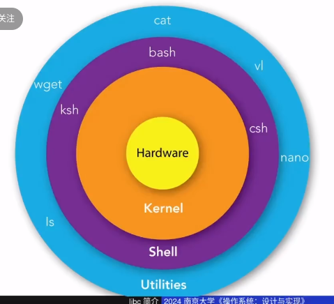
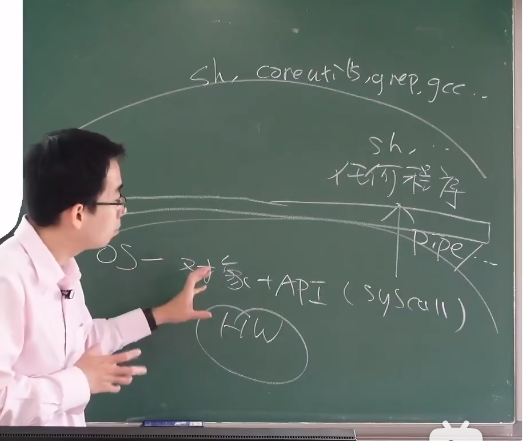
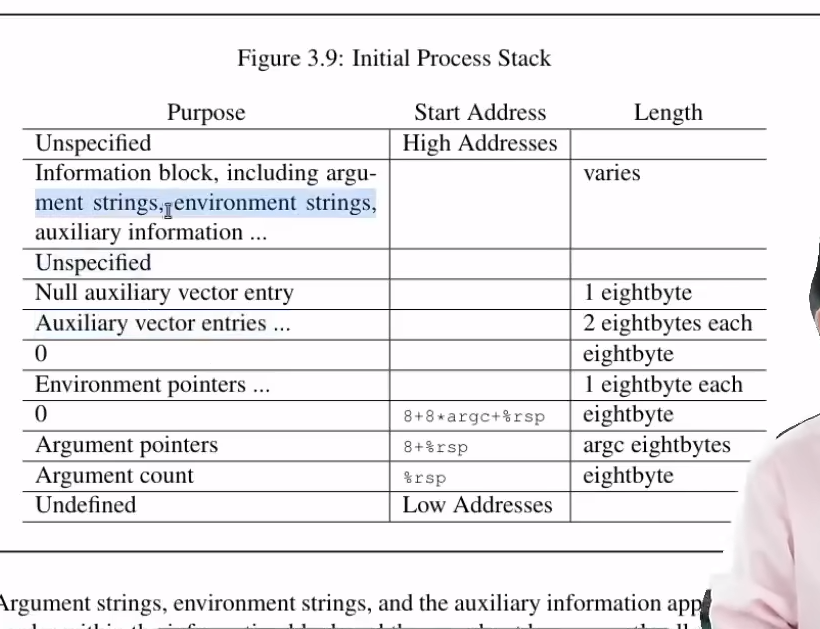

# libc

操作系统就是“洋葱”，它把晦涩难懂的硬件给虚拟成了一个个繁荣的世界。

理论上，OS+SYSCALL+HW就能编写任何程序，比如上节课使用syscall编写了shell。但是要直接使用syscall很困难，所以有了libc 把syscall给封装起来使用，利于编写程序。

系统调用是地基，C语言是框架。

C很可靠稳定：
C语言的标准化是指C语言的规范和特性由国际标准化组织（ISO）通过发布的标准来定义，例如ISO C90、C99、C11等。这些标准确保了C语言的一致性和稳定性，使得即使在新版本的C语言标准发布后，旧代码也能继续工作，而不会因为更新导致库头文件消失。

相比之下，Java和Python等语言虽然也有自己的更新和版本控制机制，但它们的生态系统更加动态，经常会有新的库和框架出现，同时也有一些旧的库被弃用。这种快速发展可能导致依赖关系破坏，尤其是当开发者没有严格遵循向后兼容性原则时。

# _start 一个程序的一生

- 当一个程序开始运行时，操作系统确实会加载程序到内存中，并设置程序的执行环境。这包括创建一个新的进程，分配内存空间，并将程序的命令行参数放置在栈上。这些参数包括argc（参数数量）和argv（参数向量），其中argv[0]通常是指向程序的指针，argv[1]及之后的元素是传递给程序的其他参数的指针。

- _start是程序开始执行的地方，它是由链接器设置的入口点。主要作用是加载栈中的argc和argv.在_start之后，控制权会传递给libc的启动代码，通常是名为__libc_start_main的函数。这个函数会设置C运行时环境，包括处理命令行参数和环境变量，然后调用main函数。main函数是程序员编写的程序的入口点。当main函数执行完毕后，它会返回一个整数值，通常用来表示程序的退出状态。

- 在main函数返回后，__libc_start_main会调用exit函数。exit函数会执行一些清理工作，比如调用注册给atexit的函数，刷新标准I/O缓冲区，并通知操作系统程序已经结束。这确保了即使程序中有未刷新的输出，也会在程序退出前被写出。最后，exit函数会执行系统调用，通知操作系统程序已经结束，并提供退出状态。
  

初始化进程后，栈的信息分布

# malloc 和 free
操作系统中，强调不要脱离实际。 可能在算法课中，我们常常会想最坏情况，但那是脱离实际的，我们要基于workland编程。  不要为了最坏的情况过度优化，==过度优化是犯罪的root==

在理解需求需要什么性能之前就去优化就是耍流氓。
脱开实际操作遇到的workland 去过度想最坏情况就是耍流氓。

malloc 其实就是分为多个内存分配器。 他们取固定已经写死的内存。 所以只需要找到对应的内存分配器就可以分配内存，而不是遍历内存找到空闲空间。

系统人他们接受适当的浪费，所以内存分配器有些会大一点。