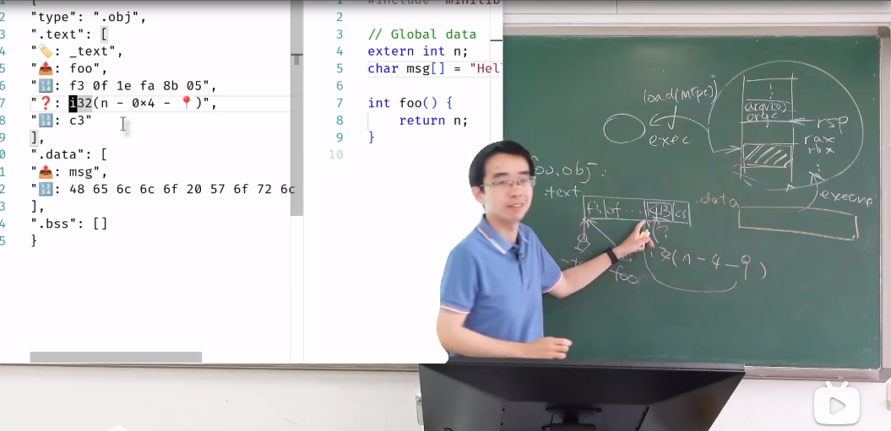
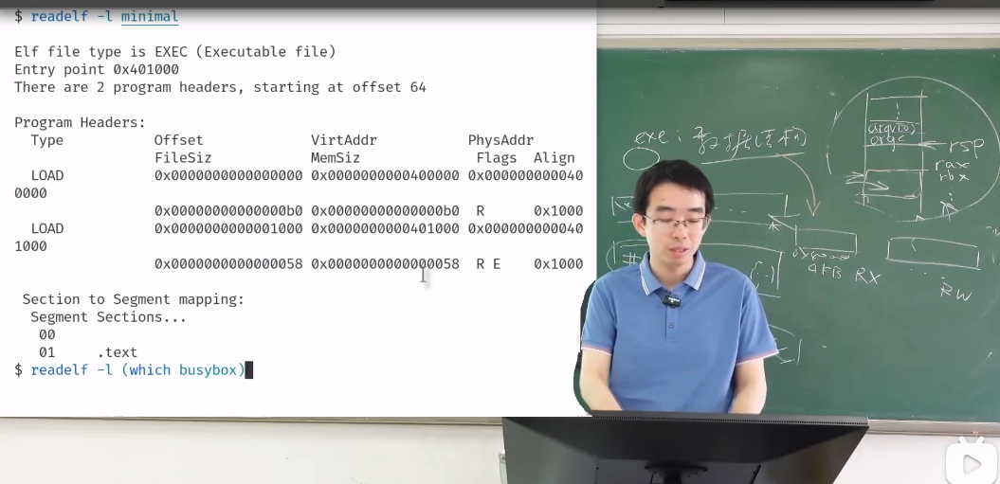

# 可执行文件
**可执行文件**: execve加载完后,地址空间里应该有的东西,是一个描述了状态机初始状态的数据结构.

**PE（Portable Executable**格式
PE格式是Windows操作系统中使用的可执行文件格式。它的结构主要包括以下几个部分：

**文件头（File Header）**：

**文件头**包含了关于文件的基本信息，比如文件的类型（是可执行文件、动态链接库还是其他类型）、文件的大小、程序的入口点（程序从哪里开始执行）等。

**段表（Section Table）：**

段表是一个表格，列出了文件中所有的段（Section）。每个段是一个逻辑上的块，包含了代码、数据或其他类型的信息。
例如，有一个段可能包含了程序的代码（机器指令），另一个段可能包含了程序的数据（全局变量和静态变量）。

**符号表（Symbol Table）：**

符号表包含了程序中定义和引用的符号（如函数名、变量名等）。
符号表在链接和调试过程中非常重要，因为它可以帮助链接器找到正确的函数和变量，也可以帮助调试器显示有意义的符号名。

**重定位表（Relocation Table）：**

重定位表的概念
重定位表（Relocation Table）是一个包含需要重定位的地址的列表。当一个程序被编译和链接成可执行文件时，编译器和链接器并不知道这个程序将来会被加载到内存中的哪个位置。因此，它们会在可执行文件中留下一些“占位符”，这些占位符在程序被加载到内存时需要被调整（重定位）。

**例子**
假设我们有一个简单的C程序：

```c
#include <stdio.h>

int global_var = 42;

void print_global_var() {
    printf("Global variable: %d\n", global_var);
}

int main() {
    print_global_var();
    return 0;
}
```
当我们编译这个程序时，编译器会生成机器代码和数据。假设在生成的机器代码中，有一条指令是用来访问全局变量 global_var 的。由于编译器不知道 global_var 在内存中的确切地址，它会生成一个“占位符”地址。

重定位表的作用
重定位表的作用就是记录这些“占位符”地址，并在程序被加载到内存时，根据实际的加载地址对这些地址进行调整。

假设在生成的可执行文件中，有一条指令是用来访问 global_var 的，这条指令的地址部分是一个“占位符”地址，比如 0x1000。重定位表会记录这个地址 0x1000 需要被重定位。

当操作系统加载这个程序到内存时，假设 global_var 的实际地址是 0x8000。操作系统会查找重定位表，找到地址 0x1000，并将其调整为 0x8000。

重定位表的结构
重定位表通常包含以下信息：

需要重定位的地址：这是在可执行文件中的一个偏移量，指向需要被调整的地址。

重定位类型：这指定了如何调整这个地址。不同的重定位类型有不同的调整方式。
符号索引：这指向符号表中的一个条目，表示这个地址需要被调整到哪个符号的实际地址。在可执行文件中，确实会有很多占位符。这些占位符主要出现在以下几个地方：

全局变量和静态变量的地址：在程序中访问全局变量和静态变量时，编译器会生成占位符来表示这些变量的地址。

函数调用的地址：在调用函数时，编译器会生成占位符来表示函数的入口地址。

动态链接库中的符号地址：如果程序依赖于动态链接库（如Windows的DLL或Linux的共享对象），在编译时这些符号的地址也是未知的，因此也需要使用占位符。


**ELF（Executable and Linkable Format）格式**
ELF格式是Unix/Linux操作系统中使用的可执行文件格式。它的结构和PE格式类似，也包括文件头、段表、符号表和重定位表等部分，但具体的细节可能有所不同。

文件头（File Header）：

和PE格式一样，ELF文件头包含了文件的基本信息，如文件类型、文件大小、程序入口点等。

段表（Section Table）：

ELF文件中的段表也列出了文件中所有的段。每个段包含了代码、数据或其他类型的信息。

符号表（Symbol Table）：

ELF文件中的符号表同样包含了程序中定义和引用的符号。

重定位表（Relocation Table）：

ELF文件中的重定位表也包含了需要重定位的地址的列表

---

# Friendly Leawrning Executable

ELF是复杂的,它为了性能而抛弃了许多易读性. 我们读readelf 不异于读天书.所以老师创建了fle,帮我们理解elf的核心组成部分.

链接和加载中的核心概念:**代码,符号,重定位**.所以抓住这三个要点,我们可以自己实现一个人类易读的,可执行文件结构 'FLE'.

首先老师把文件编译成ELF格式,然后把ELF重要的三点提取出来自定义成FLE格式,其次老师展示了怎么链接FLE格式且运行FLE格式

**obj目标二进制文件中,常常包含.txt代码段和.data数据段.**  从代码段我们可以清晰看到它包含_text书签(书签标记代码的某段),foo全局书签,代码段,重定位. 

这就是可执行文件的基本架构

### 编译过程:
**编译过程：**
编译器将源代码转换为机器代码，生成目标文件（如 .o 文件）。在这个阶段，编译器会为每个函数和全局变量分配一个相对地址，这些地址是相对于目标文件的开始位置的。
由于编译器是独立地编译每个源文件的，它无法确定全局变量和函数的最终内存地址，因为这些地址需要在链接阶段才能确定。

**链接过程：**
链接器将多个目标文件和库文件合并成一个可执行文件或共享库。在这个过程中，链接器需要解决各个目标文件之间的符号引用问题。
符号引用是指在一个目标文件中引用了另一个目标文件中的函数或变量，但这些符号的最终地址还不知道。链接器会为这些符号分配最终的内存地址，并更新所有引用这些符号的地方。

**重定位：**
重定位是指在链接过程中，将目标文件中的相对地址转换为最终的绝对地址。这个过程包括以下几个步骤：
符号解析：链接器解析所有未定义的符号，确定它们在哪个目标文件或库中定义。
地址分配：链接器为每个符号分配最终的内存地址。
地址更新：链接器更新所有引用这些符号的地方，将相对地址替换为绝对地址。

**加载过程：**
当可执行文件或共享库被加载到内存中时，操作系统会为它分配实际的内存地址。对于静态链接的可执行文件，这个过程通常不需要额外的重定位，因为链接器已经完成了所有必要的地址更新。
对于动态链接的共享库，加载器可能需要在运行时进行重定位，因为共享库的加载地址可能会有所不同。这个过程称为动态重定位或延迟绑定（通过 PLT/GOT 机制实现）。

总结一下，重定位是在编译和链接过程中确定程序中各个部分在内存中的最终地址的过程。编译器在编译阶段为每个函数和全局变量分配相对地址，而链接器在链接阶段通过重定位将这些相对地址转换为绝对地址。对于动态链接的共享库，加载器可能需要在运行时进行额外的重定位。

## 编译器链接

链接器的主要任务是将多个目标文件和库文件合并成一个可执行文件或共享库，并解决以下问题：

- 符号解析（Symbol Resolution）：确定每个符号的定义位置。

- 重定位（Relocation）：为每个符号分配最终的内存地址，并更新所有引用这些符号的地方。

- 合并代码和数据段：将所有目标文件和库文件的代码段、数据段等合并成一个整体。

3. 符号解析
符号解析是链接器确定每个符号定义位置的过程。链接器会遍历所有目标文件和库文件的符号表，解析每个未定义的符号，并确定它们在哪个文件中定义。如果某个符号在多个文件中定义，链接器会选择其中一个定义，并报告重复定义错误。

4. 重定位
重定位是链接器为每个符号分配最终内存地址的过程。链接器会为每个符号分配一个唯一的内存地址，并更新所有引用这些符号的地方。重定位包括以下几个步骤：
- 地址分配：为每个符号分配最终的内存地址。

- 地址更新：更新所有引用这些符号的地方，将相对地址替换为绝对地址。

5. 合并代码和数据段
链接器会将所有目标文件和库文件的代码段、数据段等合并成一个整体。合并后的可执行文件或共享库包含以下几个部分：

代码段（.text）：包含所有目标文件和库文件的代码段。

数据段（.data）：包含所有目标文件和库文件的数据段。

未初始化数据段（.bss）：包含所有目标文件和库文件的未初始化数据段。

符号表（Symbol Table）：包含所有目标文件和库文件的符号表。

重定位表（Relocation Table）：包含所有目标文件和库文件的重定位表。

链接后,每个文件都有自己的.txt .data, 链接后类似合并同类项,把.txt都和在一起,把.data都合在一起. 在这种情况下,各个段的各个符号的内存位置(已经分配虚拟内存)就已经确定了,就可以完成重定向. 至此,可执行文件的三要素就齐全了:符号,代码,重定向.

当可执行文件被加载到内存中时，操作系统会根据ELF文件中的信息（如程序头表）将各个段加载到相应的虚拟地址。动态链接器会在程序运行前处理动态链接库的加载和符号解析。

## Shebang
Unix世界中为了程序不太冗长,允许在编译文件开头中加上:

```shell
#!+编译器名称
```

# ELF

ELF也是将字节序列赋值到内存空间中,然后调转到entry point(_start)开始运行.但是特别的是,它是分段授权,分段赋值的.

上面我们给出了定义:可执行文件描述状态机的初始状态,那么具体描述了什么东西呢:
**描述了具体哪一段要分配到虚拟内存的哪一个位置,并且各个段的执行权限是多少**

更加了解了execve的实现,对于file可执行程序,其实execve首先按照elf文件的要求把对应的段赋值到虚拟内存的指定位置(利用elf的设计者设计的loder可以得到elf信息),随后创建了一个stack,把argc,*argv,envp都都传入,然后返回一个栈顶指针. 然后跳转到_start执行.
