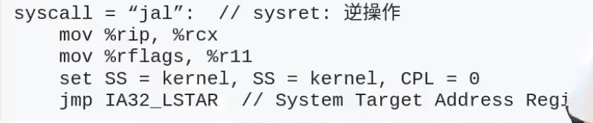
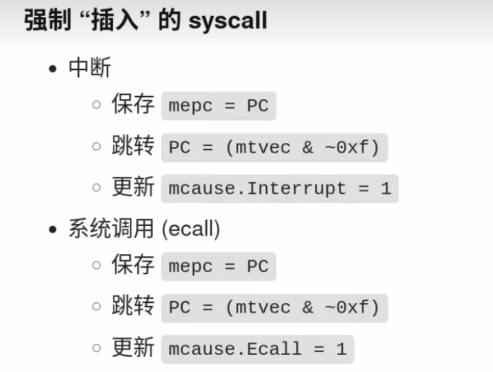
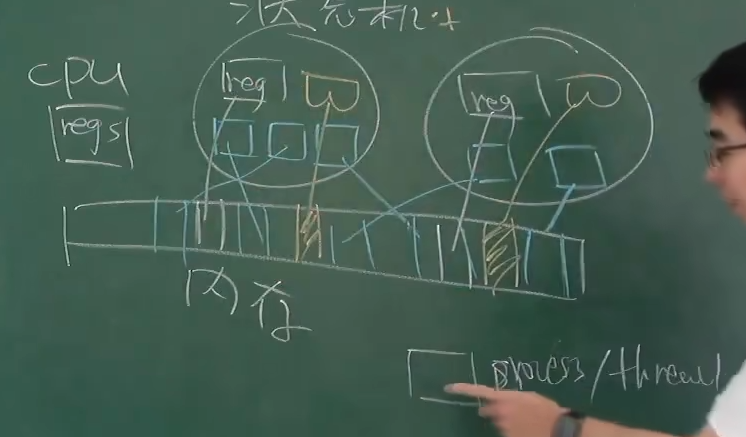
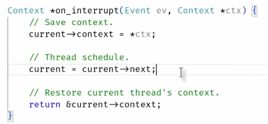

# 系统调用
**syscall** ： 跳转并获得了无限的权利。
从一个状态到另一个状态，同时获得能力。

LSTAR寄存器存储了系统调用处理程序的入口地址。当用户程序执行syscall指令时，CPU会自动将当前的指令指针（RIP）和处理器状态保存到特定的寄存器中，然后提权，将RIP设置为LSTAR寄存器中存储的地址，从而跳转到系统调用处理程序。

在Linux内核中，LSTAR寄存器通常被设置为指向系统调用表（sys_call_table）中的一个特定函数，该函数负责处理所有的系统调用。通过这种方式，操作系统可以高效地从用户模式切换到内核模式，执行必要的系统调用处理，然后返回到用户模式继续执行。

syscall保存程序执行的寄存器的值，sysret恢复寄存器的值。

# 中断和上下文切换

我们深知CPU是无情的执行指令的机器。那么处理死循环命令时它无法退出，它只能一直运行。 我们需要中断。

中断可以看作就是被插入的syscall指令，是被动的。 因为它的实现过程是和syscall差不多的。

应用程序不可关中断。

**中断触发**：当硬件或软件中断发生时，CPU会立即停止当前正在执行的指令流。

**保存现场**：为了确保中断处理完成后能够正确恢复到中断前的状态，CPU需要保存当前的寄存器状态。这个过程通常包括以下几个步骤：

**切换堆栈**：如果中断是可屏蔽的（如IRQ），CPU可能会切换到一个特定的中断堆栈。

**保存寄存器**：CPU将当前的寄存器值（如程序计数器PC、状态寄存器、通用寄存器等）压入堆栈。这个过程通常是由硬件自动完成的，称为“压栈”操作。

**执行中断服务例程（ISR）**：保存完寄存器状态后，CPU会跳转到预先定义的中断服务例程（ISR），开始执行中断处理代码。

**恢复现场**：中断处理完成后，CPU需要恢复到中断前的状态。这个过程包括以下几个步骤：

弹栈：CPU从堆栈中恢复之前保存的寄存器值。

返回：CPU返回到中断前的指令流，继续执行被中断的程序。

# 运行过程
进程内存中的分布

CPU选择一个执行，并当得到中段时分为以下三步：

