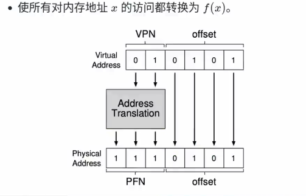
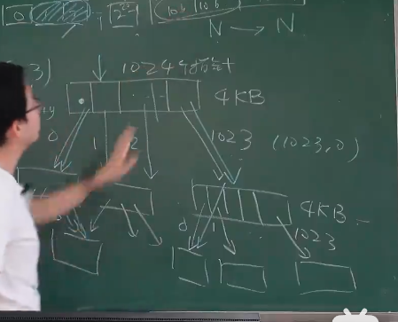
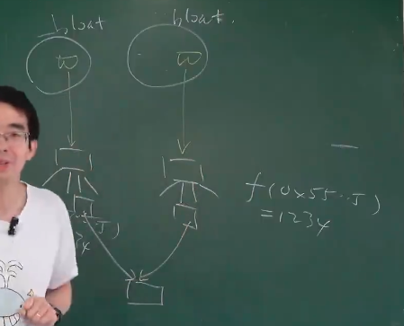
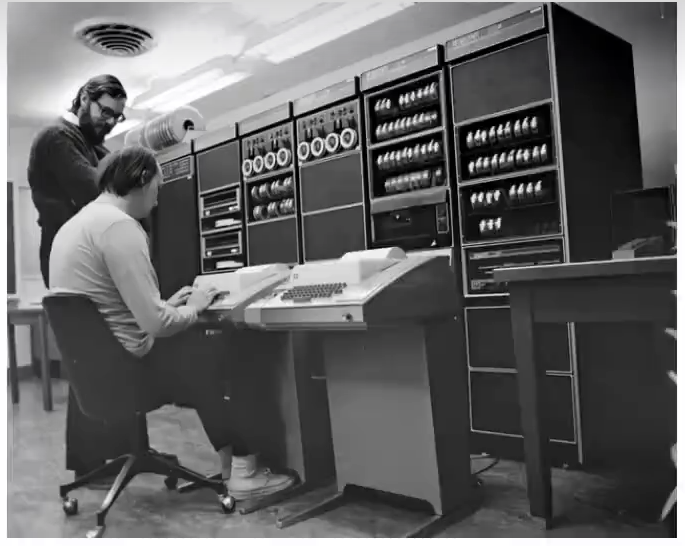

# 进程-带上VR眼镜（虚拟内存）
==一般程序员编写程序接触到的都是虚拟内存==

进程的VR眼镜能够把得到的虚拟内存翻译成物理内存。

比如，在64位地址空间中，48位有效地址，其中的36位时虚拟地址，进程会把它翻译成对应的物理页。

##  VR---页表 data structure
页表的功能是完成从整数到整数的映射。把虚拟内存的36位地址码对应到具体内存页码。

CPU的CR3寄存器指向页表的根，当需要转换的时候会通过CR3使用页表。

那么这个页表我们怎么实现呢？在数据结构课中我知道查找的话常用红黑树（二叉搜索树）和哈希表。 但是红黑数查询效率不高，哈希表实现困难（数据量太大 2.36. 最终答案是**Radix Tree**

### Radix Tree

类似与B Tree 有多个节点同时被保存为一个节点.

用32bit的举例.一个指针是4字节,一个页块大概4kb,正好可以存储1024个地址空间.对于两级页表来说:每个页号至少通过了两个数字.第一层x,第二层y.得到(x,y),把这个转换成物理地址:x*1024+y.

### TLB
我学到这应该想到:如果用虚拟地址VR眼镜,那么每次load指令都要查询一次页表? 那这个代价是无法接受的.  所有TLB出现了.

因为程序运行时我们发现它总是在**不断的重复访问某一段相同的代码**(比如递归执行函数,使用变量),所以CPU设置了一个TLB缓存,保存最近访问的虚拟地址及其对应的页号.

# Demanding paging 
如果一个动态链接库要求占用100m的内存，我们如若创建1000个这个动态链接库为什么我们的16G内存还能扛住？

这是因为操作系统了解到是同一个动态链接库，操作系统只会保存一份副本。==只要是同一个数据，100G也不会占满内存==

我们把磁盘数据加载进内存就可以是指针访问它。具体操作流程：**首先不会直接把磁盘复制进内存**，而是标志内存某一段已经被占用。其次当访问的时候，访问到没有分配的数据就会发生Page Fault。操作系统会自动分配（把这个磁盘数据映射到页表中，这样就可以直接通过虚拟内存访问）。

==Demand Paging 是一种虚拟内存管理技术，其中操作系统不会立即将磁盘数据复制到内存中。相反，它会标记内存中的某些段已经被占用。当程序试图访问尚未加载到内存中的数据时，会发生页错误（Page Fault）。操作系统会处理这个错误，将所需的磁盘数据加载到内存中，并更新页表，使得程序可以通过虚拟内存地址访问这些数据==

**Demand Paging** 是一种虚拟内存管理技术，主要用于提高内存使用效率和系统性能。它的核心思想是“**按需加载**”，即只有在程序实际需要访问某个页面时，才将该页面从磁盘加载到内存中。

具体步骤：
**页表管理**：

操作系统维护一个页表，记录每个进程的虚拟地址空间和物理内存之间的映射关系。

初始时，页表中的某些条目可能被标记为无效（Invalid），表示这些页面尚未加载到内存中。

**页错误（Page Fault）**：

当程序试图访问一个标记为无效的页面时，CPU会触发页错误（Page Fault）。

页错误会引发操作系统的异常处理机制，操作系统会接管控制权。

**页面加载：**

操作系统会查找页表，确认该页面确实不在内存中。

==操作系统会选择一个空闲的物理内存页面（或通过页面置换算法选择一个牺牲页面）==，将所需的磁盘页面加载到这个物理内存页面中。

更新页表，将该虚拟页面对应的条目标记为有效（Valid），并记录其对应的物理内存地址。

**重新执行指令**：

页面加载完成后，操作系统会重新执行引发页错误的指令。

这次访问会成功，因为所需的页面已经在内存中了。

**Demand Paging 的作用**
**提高内存使用效率**：
- 通过按需加载页面，避免了将所有页面一次性加载到内存中，从而节省了内存空间。

- 只有实际使用的页面才会占用内存，提高了内存的使用效率。
支持更大的虚拟地址空间：

- 通过虚拟内存技术，程序可以使用比实际物理内存更大的地址空间。这使得大型程序可以在内存有限的情况下运行。

**提高系统性能：**

由于只有实际使用的页面才会被加载到内存中，减少了不必要的I/O操作，提高了系统性能。

通过页面置换算法，操作系统可以选择性地将不常用的页面换出到磁盘，进一步优化内存使用。

**简化程序开发：**

程序员可以编写更大规模的程序，而不必担心内存限制。

操作系统负责管理内存和磁盘之间的页面交换，简化了程序的内存管理任务。

# UNIX和XV6

xv6是MIT自己复刻的UNIX。完全开源出来了源代码。