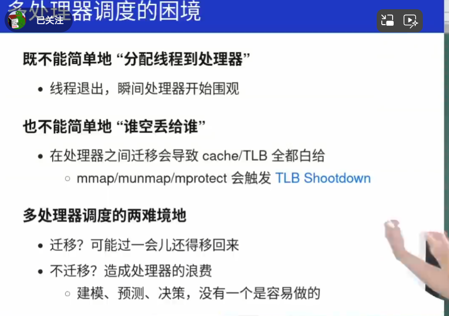

# Trampoline 跳板
使用场景：
- 调用printf：当运行的代码加载进内存的时候，printf的内存才会确定。所以计算机先会访问PLT，PLT其次会跳转到GOT表查询目标函数，再去目标地址执行。者也是跳板。
- xv6：因为传统linux可以看到内核代码，虽说不准访问，但是可能会通过缓存等方式得到一定的内核代码，**不安全**。 xv6控制VR眼镜完全看不到内核代码，但是提供了跳板代码实现向内核的跳转。
- 其他应用：如热补丁等（首先把更新的版本加载到内存中，然后在旧版本中加载跳转代码就行了。）

# 处理器调度原理
当发生处理器调度的时候，如何更好的分配CPU资源？选择哪一个进程继续执行？这就需要更好的CPU调度策略。
## Niceness
unix通过Niceness（好坏程度 通常是-20-19）来评价各个进程。越好的进程它越愿意把CPU让给别人.
nice值相差十，CPU资源获得率大概相差十倍。

**nice值和公平共享**：

如果所有进程的nice值相等，操作系统通常会采用某种形式的公平调度策略，如时间片轮转（Round Robin），确保每个进程都能公平地获得CPU时间。
## 公平共享策略的弊端
**I/O操作和进程调度：**

当一个进程（如VSCode）执行I/O操作时，它通常会进入阻塞状态，等待I/O操作完成。此时，操作系统会将CPU资源分配给其他可运行的进程。

当I/O操作完成（例如，键盘输入），操作系统会将该进程从阻塞状态移到就绪状态，等待下一次调度。

**实时响应和优先级：**

在标准的Unix/Linux调度策略中，如CFS（Completely Fair Scheduler），并没有直接的机制来保证某个进程在I/O事件发生后立即获得CPU。因此，即使某个进程的I/O操作已经完成，它也需要等待当前正在运行的进程用完其时间片，或者等待其他进程的vruntime值超过它，才能获得CPU资源。

为了实现更实时的响应，可以使用实时调度策略（如FIFO、RR等），或者通过调整进程的优先级（使用nice或renice命令）来影响调度器的行为。

**改进用户体验：**

对于需要快速响应用户输入的应用程序（如VSCode），可以考虑使用更高的优先级，或者在设计时采用异步I/O和事件驱动模型，以减少阻塞时间并提高响应性。

操作系统通常会提供一些机制来处理高优先级的I/O中断，确保关键任务能够及时得到处理。

**动态调度策略：**  要计算机自己动态调整进程优先级。当进程执行完时间片后，优先级往下放。 当进程主动让出CPU时，优先级往上放。

## CFS 现在linux使用的策略 完全公平分配策略
==尽可能的要所有的线程公平分享CPU==。

实现的细节：
记录每一个进程的执行时间。每次都优先执行运行时间少的的进程，以达到公平。但是这个执行时间不是实际运行时间，而是结合了niceness优先级的**virural time**。 **当优先级高的进程，可能1ms的虚拟时间就是1ms，但是优先级较低的进程，1ms可能就是100ms。**

# 真实的处理器调度问题
## 优先级反转

调度的一个特殊情况是**优先级反转（Priority Inversion）**，这种情况通常发生在低优先级进程持有锁时，被高优先级进程抢占，而高优先级进程又需要这个锁。这种情况下，**高优先级进程会被阻塞（block）**，直到低优先级进程释放锁

这种情况下，高优先级进程（H）被低优先级进程（L）阻塞，导致高优先级进程无法及时执行。这种现象被称为优先级反转，因为它违反了优先级调度的原则，即高优先级进程应该优先于低优先级进程执行。

##  多处理器的困境

不能随机分配线程。
重要的是要考虑能不能把线程从忙的处理器丢到闲的处理器上。

### numa架构和多用户
numa架构比SMP还要更加复杂，它访问内存的速度取决于物理位置，离内存的距离。 

多用户的难题：如何使用合适的调度策略高效且公平的适配多个用户。如果使用CFS，那么A用户需要10000个线程，B用户只需要1个线程，显然对于B用户分配到的CPU是不公平的

## 程序执行很复杂，可能更少的CPU，执行的越快
缓存一致性开销：

在多核系统中，每个核心都有自己的缓存。当多个线程并发地对同一个变量进行操作时，需要维护缓存一致性，确保所有核心看到的变量值是一致的。这会导致额外的开销，包括缓存行（cache line）的传输和同步操作，从而降低性能。

在单核系统中，所有线程共享同一个缓存，不需要维护缓存一致性，因此开销较小。

# 虚拟化的总结
进程，它是虚拟化的 CPU；
地址空间，它是虚拟化的内存。在这两种抽象共同作用下，程序运行时就好像它在自己的
私有独立世界中一样，好像它有自己的处理器（或多处理器），好像它有自己的内存。这种
假象使得对系统编程变得更容易