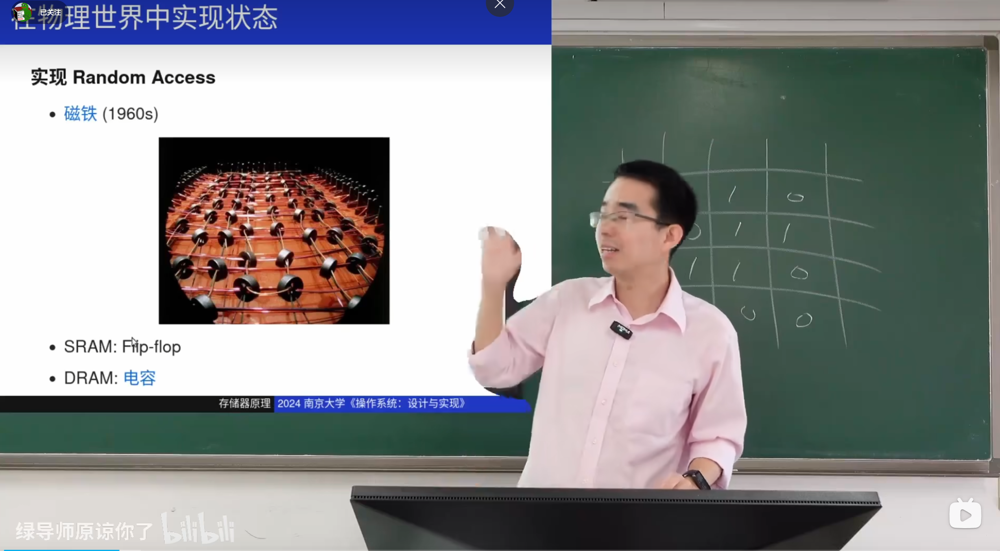
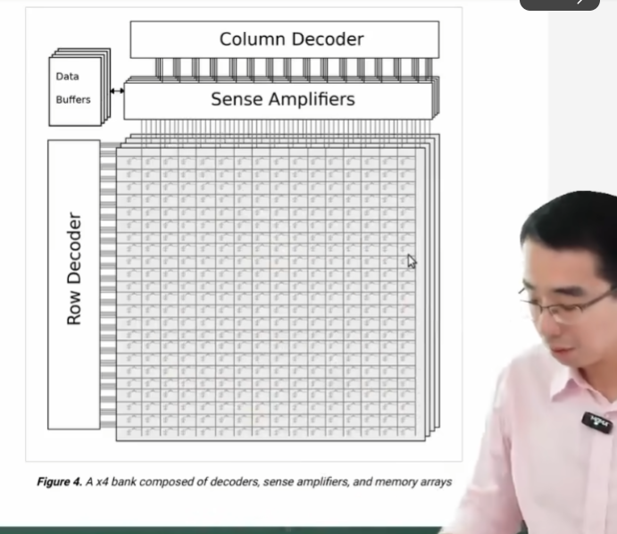
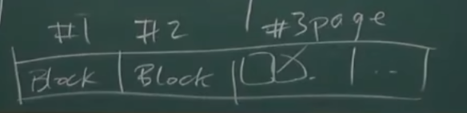
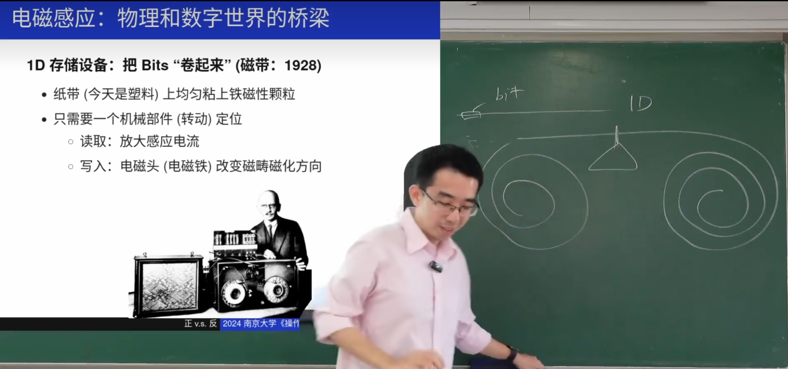
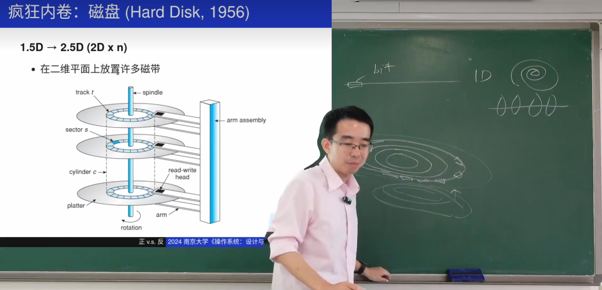
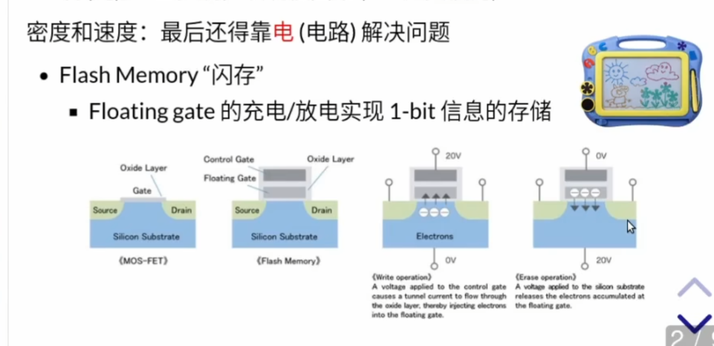

# 在物理世界的实现

起初用磁铁存储数据，通过电磁感应读出0和1.

这是真实的内存存储方式（DRAM）。每一个小格子都是一个电容器。
DRAM因为是电容器，因此会不可避免的发生漏电，所以不是持久化存储，需要定时借助缓存刷新

**内存的抽象**：

# 磁存储器

## 磁带
磁带就是纸袋上（现在多是塑料袋）上洒满了磁性颗粒用来存储数据，通过读写头（小磁针）和电磁感应来读写数据。

**写入数据**：当需要写入数据时，读写头会产生一个磁场，这个磁场会根据要写入的数据（0或1）改变磁性涂层的磁化状态。例如，如果写入1，磁性颗粒会被磁化；如果写入0，磁性颗粒不会被磁化。

**读取数据**：当需要读取数据时，读写头会感应磁性涂层的磁化状态。根据磁性颗粒的磁化状态，读写头会产生一个电信号，这个电信号可以被转换成数字数据（0或1）。
因为磁带的读取过程中是顺序的，常常用来存储顺序的资源如电影，音乐。

## hard disk
可以理解成就是很多很多个磁带围绕在一起：
采用里三层外三层的方式，在圆形平面上放置足够多的磁带，然后介质的反面也可以防止足够多的磁带。再者可以有多个圆形平面。这样就可以组成2.5维的存储结构。

任何现代磁盘驱动器都有一个重要组成部分，即它的缓存（cache），由于历史原因有时称为磁道缓冲区（track buffer）。该缓存只是少量的内存（通常大约 8MB 或 16MB），驱动器可以使用这些内存来保存从磁盘读取或写入磁盘的数据。例如，当从磁盘读取扇区时，驱动器可能决定读取该磁道上的所有扇区并将其缓存在其存储器中。这样做可以让驱动器快速响应所有后续对同一磁道的请求。

## 软盘 Floppy Disk （数据移动）

软盘（Floppy Disk）是一种早期的可移动存储介质，用于存储和传输数据。它由一个柔软的塑料圆盘组成，表面涂有磁性材料，通常封装在一个硬塑料外壳中以保护磁盘。

### 软盘的结构

1. **磁盘**：软盘的核心部分是一个柔软的塑料圆盘，表面涂有磁性材料，用于存储数据。
2. **外壳**：为了保护磁盘不受灰尘和物理损伤，软盘通常封装在一个硬塑料外壳中。外壳上有一个或多个开口，允许读写头接触磁盘表面。
3. **读写头**：软盘驱动器中的读写头通过外壳上的开口接触磁盘表面，用于读取和写入数据。

### 数据移动的方法

1. **插入和取出**：用户可以将软盘插入软盘驱动器的插槽中，数据读写完成后，可以将其取出。
2. **旋转和读写**：当软盘插入驱动器后，驱动器中的电机会使软盘旋转。读写头会接触磁盘表面，根据磁盘的旋转和读写头的移动，读取或写入数据。

### 存储数据的方式

软盘通过磁性材料的磁化状态来存储数据。具体来说：

1. **磁化区域**：磁盘表面的磁性材料可以被磁化成不同的极性（例如，南极或北极），这些极性代表二进制数据（0和1）。
2. **磁道和扇区**：磁盘表面被划分为多个同心圆磁道（Tracks），每个磁道又被划分为多个扇区（Sectors）。数据以扇区为单位存储和读取。
3. **读写过程**：当读写头接触磁盘表面时，它会感应磁化区域的极性，从而读取数据。写入数据时，读写头会产生磁场，改变磁化区域的极性。

## 软盘的局限性

1. **容量有限**：软盘的存储容量相对较小，常见的软盘容量为1.44MB，无法满足现代数据存储需求。
2. **易损坏**：软盘容易受到物理损伤、灰尘和磁场的影响，导致数据丢失或无法读取。
3. **读写速度慢**：软盘的读写速度较慢，无法满足快速数据传输的需求。
4. **不支持随机访问**：软盘是一种顺序访问介质，访问数据时需要按顺序读取，效率较低。

# 坑存储
## 光盘

用**激光在盘面上挖了坑**，然后会用激光读取数据。
但是这是不可逆的，只能写不能改的。
但是它风靡的原因就是足够方便，只需要一个母盘，制造光盘的效率就十分快速。存储的空间也足够大

# 电存储

因为磁存储的机械结构受限，坑存储不可改，最后的解决方案是电存储。

但是电子的有一个致命伤：放电的时候无法放干净，总是由残留。这导致可能存储的文件反复修改存储了近千次，这个U盘就爆掉了，就存不进东西了因为垃圾残留太多了。

## SSD
在SSD中引入了FTL（闪存转换层）来解决电存储的问题：

FTL是"Flash Translation Layer"的缩写，中文通常翻译为“闪存转换层”。**FTL是固态硬盘（SSD）中的一个重要软件层，位于主机系统和闪存存储芯片之间。它的主要功能是管理闪存存储器的读写操作，使得闪存设备能够像传统的硬盘驱动器（HDD）一样被操作系统使用。**

FTL的主要职责包括：

**地址映射**：将主机系统发出的逻辑块地址（LBA）转换为闪存芯片上的物理页地址（PPA）。这是因为闪存的物理特性（如擦除块的大小和寿命限制）与传统的硬盘驱动器不同，需要通过地址映射来进行适配。

**磨损均衡**：由于闪存芯片的每个存储单元都有一定的擦写次数限制，FTL会通过磨损均衡算法来均匀分配擦写操作，以延长SSD的使用寿命。

**垃圾回收**：闪存芯片在写入新数据之前需要先擦除旧数据，但擦除操作只能在擦除块级别进行。FTL会管理垃圾回收过程，即在后台擦除不再需要的旧数据，以便为新数据腾出空间。  ==读写是页级，擦除是块级==

**坏块管理**：FTL还会管理闪存芯片上的坏块，通过替换算法将坏块替换为备用块，以保证数据的完整性和可靠性。

##  FLT可能带来的问题
当数据格式化后，数据并没有删除，还是可以恢复。可能会导致重要的数据泄露。而是仅仅删除了文件系统的目录结构，使得操作系统认为这些空间是可用的

