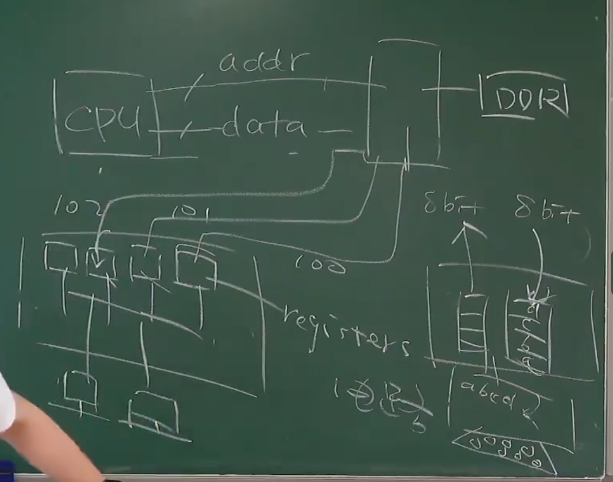
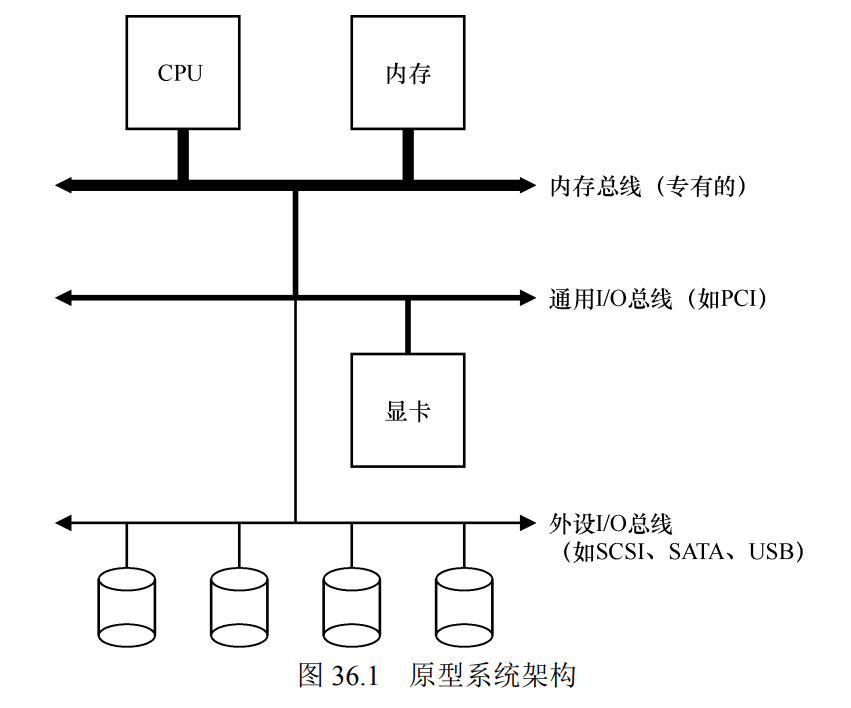
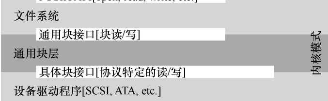
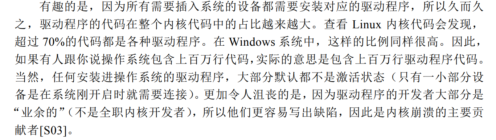

# IO设备原理
**GPIO** (General Purpose Input/Output)
GPIO（通用输入/输出）
GPIO是一种通用的输入输出接口，它允许CPU与外部设备进行通信。GPIO引脚可以配置为输入或输出模式，具体取决于应用需求。

输入模式：GPIO引脚可以读取外部设备的状态（例如，按钮是否被按下）。
输出模式：GPIO引脚可以控制外部设备的状态（例如，点亮LED灯）。

实现输入输出
配置GPIO引脚：首先，CPU需要配置GPIO引脚为输入或输出模式。这通常通过编程来完成，例如在嵌入式系统中使用C语言编写配置代码。

读取输入：
当GPIO引脚配置为输入模式时，CPU可以读取该引脚的状态。例如，如果引脚连接到一个按钮，CPU可以读取按钮是否被按下。
通过读取GPIO引脚的电平状态（高电平或低电平），CPU可以获取外部设备的状态信息。

输出控制：
当GPIO引脚配置为输出模式时，CPU可以控制该引脚的电平状态。例如，如果引脚连接到一个LED灯，CPU可以通过设置引脚的电平状态来控制LED灯的亮灭。
通过设置GPIO引脚的电平状态（高电平或低电平），CPU可以向外部设备发送控制信号。

示例
假设我们有一个简单的电路，包含一个按钮和一个LED灯，我们希望通过GPIO实现以下功能：

按下按钮时，LED灯亮起。
松开按钮时，LED灯熄灭。

配置GPIO：

将连接按钮的GPIO引脚配置为输入模式。

将连接LED灯的GPIO引脚配置为输出模式。

读取按钮状态：
在程序中，不断读取连接按钮的GPIO引脚的状态。
如果读取到按钮被按下（通常是低电平），则设置连接LED灯的GPIO引脚为高电平（LED灯亮起）。
如果读取

# 外设的组成
外设的基本组成都是一样的，内部有许多寄存器，这些寄存器连接物理按键。电脑会把寄存器映射到内存中使得读取到外设的输入。

很简单的模式： CPU -- 控制器 -- 寄存器
外设通过接口（由导线组成）来实现外设间的寄存器和电脑中的控制器相连接。

# 总线，中断控制器，DMA

## 总线
我们的IO设备映射到内存，最方便的方式就是固定每一个常见寄存器映射到固定的内存地址，把它们写死。
但是这样不利于IO设备的拓展性，那么我们就需要一个特殊的IO设备:总线来虚拟化。 

对于CPU视角来说，CPU只看到了总线，直连总线，其它的IO设备都被总线给虚拟化了。
总线有自己的内存空间，分别映射到不同的IO设备。

总线通常有自己的配置空间（如PCI配置空间），其中包含了连接到总线的设备的配置信息。这些信息包括设备类型、资源需求（如内存地址范围、I/O端口等）和设备状态等。系统固件（如BIOS/UEFI）或操作系统负责扫描总线配置空间，并根据这些信息为每个设备分配资源（如内存映射地址）。

## 中断控制器

当我们键盘按下一个按钮时，这个键盘内部寄存器就已经准备好了。但是要**CPU去处理这个数据就需要像CPU发送中断**。
但是多个IO设备都可以发送中断，CPU只有一个中断线怎么办呢，因此需要CPU中断控制器。
在CPU中断器会把收到的多个中断排好优先级，发送CPU。

### PIC（Programmable Interrupt Controller）

PIC是最早用于IBM PC兼容机的中断控制器。它主要有两个版本：8259A和它的改进版本。PIC的主要作用包括：

1. **中断管理**：PIC负责管理来自外部设备的中断请求（IRQ），并将这些请求传递给CPU。
2. **中断优先级**：PIC可以对多个中断请求进行优先级排序，确保高优先级的中断能够优先得到处理。
3. **中断屏蔽**：PIC允许通过编程来屏蔽某些中断，以防止它们被传递给CPU。

PIC的局限性在于它只能管理有限数量的中断线（通常是8个），并且不支持多处理器系统。

### APIC（Advanced Programmable Interrupt Controller）

随着多处理器系统的出现和复杂性的增加，PIC已经不能满足需求，因此APIC被引入。APIC的主要作用包括：

1. **多处理器支持**：APIC支持多处理器系统，能够将中断路由到特定的CPU核心，从而实现负载均衡和提高处理效率。
2. **中断分配**：APIC可以将中断分配给系统中的任意CPU核心，而不是像PIC那样只能将中断传递给主CPU。
3. **更灵活的中断管理**：APIC提供了更灵活的中断管理功能，包括中断优先级、中断屏蔽和中断重定向等。
4. **系统管理中断（SMI）**：APIC还支持系统管理中断，这是一种特殊的中断，用于系统管理任务，如电源管理。

APIC通常分为两种类型：

- **Local APIC**：每个CPU核心都有一个Local APIC，负责处理该核心的中断请求。
- **I/O APIC**：I/O APIC负责接收来自外部设备的中断请求，并将这些请求路由到适当的Local APIC。

APIC的出现极大地提高了中断管理的灵活性和效率，特别是在多处理器系统中。

## DMA
当CPU去处理IO请求的时候，浪费算力。那怎么办，我们只需要专门一个专门处理IO请求的处理器DMA就行了，解放CPU。

# 阅读笔记
##  系统架构

其中，CPU 通过某种内存总线（memory bus）或互连电缆连接到系统内存。图像或者其他高性能 I/O 设备通过常规的
I/O 总线（I/O bus）连接到系统，在许多现代系统中会是 PCI 或它的衍生形式。最后，更下面是外围总线（peripheral bus），如 SCSI、SATA 或者 USB。它们将最慢的设备连接到系统，包括磁盘、鼠标及其他类似设备

==这样做的原因是越快的总线成本越高，使用的就越短==，因此要高性能的IO设备离CPU更近一点是很棒的想法。

## 中断的出现节省CPU开销

起初，CPU读取IO设备的模式是：while循环不断地询问外设状态寄存器的值是否的BUSY，这叫**轮询**。这带来了不必要的CPU开销。

有了**中断**后，CPU 不再需要不断轮询设备，而是向设备发出一个请求，然后就可以让对应**进程睡眠**，切换执行其他任务。当设备完成了自身操作，会抛出一个硬件中断，引发 CPU 跳转执行操作系统预先定义好的中断服务例程

但**中断并不总是最好的选择**：当IO设备高性能速度较快的时候还是轮询性能高，因为中断的进程切换也是不小的开销。且在网络这方面，每时每刻都接受大量的包，如果每次都发出中断，那么就会导致CPU无法处理这么多的中断导致无法执行用户的任务，出现**活锁**

## DMA

因为大量的IO操作，这种简单但频繁发生的操作严重加重了CPU的负载，我们希望把CPU从IO中解救出来。
因此DMA产生了，CPU只需要告诉DMA数据在内存中的位置，要存放在哪儿（反之亦然）就行，DMA会完成剩下来的IO操作，完成后向CPU发送中断表示完成任务就行。

## 设备驱动
我们使用过程有大量的IO设备，因此我们需要考虑操作系统怎么适配如此之多的IO设备，就是**设备无关性**。

操作系统的一部分软件清楚地知道设备如何工作，我们将这部分软件称为设备驱动程序（device driver），所有**设备交互的细节都封装在其中。**

用文件系统为例：

文件系统根本不清楚底层的存储磁盘是什么样子的，也不清楚是什么牌子的。他就是只管闭着眼睛向底层发送请求。当通用块层收到请求后，就会把请求路由给对应设备的驱动程序。而真正的特异性数据交互操作由驱动程序封装。

