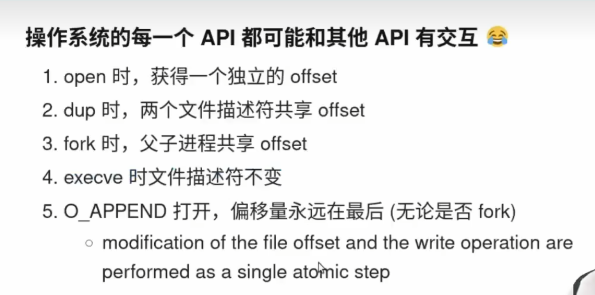
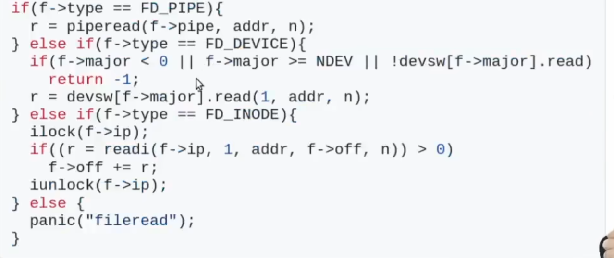

# everything is File
everything is File
在Linux操作系统中，"everything is a file"（一切皆文件）是一个核心概念。这个概念意味着在Linux系统中，许多不同类型的资源和设备都被抽象为文件或文件描述符的形式。这种统一的处理方式使得用户和程序可以使用相同的接口（如`open`、`read`、`write`、`close`等系统调用）来访问和操作各种资源。

以下是一些具体的例子，说明"everything is a file"在Linux中的体现：

1. **普通文件**：这是最常见的文件类型，包含用户数据，如文本文件、二进制文件等。

2. **目录**：目录也被视为一种特殊的文件，它包含其他文件和目录的列表。

3. **设备文件**：Linux将硬件设备（如硬盘、键盘、鼠标、打印机等）表示为文件。这些文件通常位于`/dev`目录下，可以通过读写这些文件来与设备进行交互。例如，`/dev/sda`表示第一个硬盘，`/dev/tty`表示当前终端。

4. **管道和套接字**：管道（pipe）和套接字（socket）也通过文件描述符来表示，用于进程间通信。

5. **符号链接**：符号链接（软链接）是一种特殊类型的文件，它指向另一个文件或目录。

6. **伪文件系统**：Linux还包含一些伪文件系统，如`/proc`和`/sys`。`/proc`文件系统提供了一个接口，用于访问内核数据结构，如进程信息、硬件信息等。`/sys`文件系统则提供了一个接口，用于管理和配置硬件设备。

通过将各种资源和设备抽象为文件，Linux提供了一个统一且一致的接口，使得用户和程序可以方便地访问和管理系统中的各种资源。这种设计简化了编程模型，并提高了系统的灵活性和可扩展性。

----

文件被称为**虚拟磁盘**，是因为它们在逻辑上可以看作是存储在磁盘上的数据集合，这些数据集合可以被操作系统管理和访问，就像磁盘上的其他数据一样。文件系统提供了对这些数据集合的组织、存储和检索功能，使得用户和应用程序可以方便地访问和管理数据。

**操作系统会将文件的内容映射到进程的地址空间中。**这样，进程可以直接通过内存地址访问文件内容，而不需要通过传统的文件I/O操作。

在内存映射文件时，如果尝试访问文件中未分配或未初始化的区域，可能会触发**SIGBUS**。因此分配的内存大于文件的大小会导致SIGBUS

## 文件的三个API mmap，lseek，ftruncate
mmap      ： 内存映射
lseek     ： 控制文件的offset光标
ftruncate ： 扩大文件的大小

当文件只有2MB 但是如果我们lseek到3mb的位置写入呢？ ftruncate到1mb位置呢？
    这是可以的，因为lseek会隐式的扩大文件范围。ftruncate会截断文件

## 文件fork的细节
我们知道文件都有自己的offset光标，父子进程之间是调用两个不同的光标呢，还是共用一个光标呢？
各有各的好，但是为了防止互相竞争覆盖，一般使用共用一个光标（带有锁）

# 文件光标的管理


==execve默认不会修改任何文件描述符==

----
# 文件的实现
文件描述符可以访问任何资源：很简单，大量的if或else语句来处理不同的文件描述符和相应的操作。


每次使用write等系统调用就会通过文件描述符，决定一下步的动作：
- 对于常规文件，内核可能会从磁盘上的文件读取或写入。

- 对于设备文件，内核可能会与设备驱动程序交互以执行请求的操作。

- 对于套接字，内核可以处理网络通信。

对于输入重定向给/dev/null 实际上就是open了null，写入的时候写进了null，通过文件描述符的属性判断是设备，然后通过设备驱动来处理指令。

# 设备驱动
本质就是把系统调用翻译成设备听得懂的语言
IOctl ： 设备所有非数据的功能都依靠ioctl，如配置键盘灯啊这种额外的功能。用于完成标准输入输出操作无法覆盖的设备特定功能。

# 笔记内容
## 文件系统
文件系统的实现持久化存储的两个抽象是文件和目录。
文件具有自己的inode号，而目录则包含（用户可见的名字 ： inode）对.
目录包含了目录树。
## 创建文件
操作系统中通过open调用来创建文件，
```shell
open("foo",O_CREAT | O_WRONLY | O_TRUNC)
```
返回文件描述符。

## 非顺序读写
对于每个进程打开的文件，操作系统都会跟踪一个“当前”偏移量，这将决定在文件中读取或写入时，下一次读取或写入开始的位置。
每次读取或写入都会隐式更新偏移量。第二种是明确的
lseek，它改变了上面指定的偏移量。

```shell
off_t lseek(int fildes, off_t offset, int whence); 
```

##  文件重命名

文件重命名使用了Rename系统调用，它是**原子的**
Rename系统调用常用来实现文件的原子更新，首先创建一个暂时的文件，把新版本写进新文件中，然后执行原子的Rename把名字写成原来文件的名字，删除原来的文件就实现了原子的更新，

## 文件的删除
命令是 rm
使用strace调用发现系统调用是unlink

```shell
rm * // 匹配当前目录下所有的文件，但是无法对子目录进行影响

rm -rf * // 递归对子目录进行文件进行匹配删除。 若是根目录就删完了都
```

## 创建目录

首先明确**你永远不能直接写入目录。因为目录的格式被视为文件系统元数据，所以你只能间接更新目录，例如，通过在其中创建文件、目录或其他对象类型。**

目录创建时，它被认为是“空的”，尽管它实际上包含最少的内容。具体来说，空目录有两个条目：一个引用自身的条目，一个引用其父目录的条目。前者称为“.”（点）目录，后者称为“..”（点-点）目录。


## 删除目录
rmdir  但是因为目录包含文件较多，删除目录是一个危险行为，只能在目录空的时候才能够执行rmdir


## 硬链接

创建一个文件时，实际上做了两件事：
首先，要构建一个结构（inode），它将跟踪几乎所有关于文件的信息，包括其大小、文件块在磁盘上的位置等等。其次，将人类可读的名称链接到该文件，并将该链接放入目录中。

硬链接通过**link系统调用**(ln 旧文件  新文件)，创建一个新文件指向旧文件的**inode号**，此时可以通过新文件和旧文件一起操控这个文件

在创建文件的硬链接之后，在文件系统中，原有文件名（file）和新创建的文件名（file2）之间没有区别。实际上，它们都只是指向文件底层元数据的链接


## 软链接（符号链接）

硬链接有点局限：你不能创建目录的硬链接（因为担心会在目录树中创建一个环）。你不能硬链接到其他磁盘分区中的文件（因为 inode 号在特定文件系统中是唯一的，而不是跨文件系统）

软连接的使用方法和硬链接几乎一致:
```shell
ln -s file file2
```
但是底层逻辑却完全不一样：
-  软连接是文件系统除文件，目录外的第三个属性。
-  硬链接当旧文件被删除，inode不会被删除，新文件还可以访问，但是如果软连接这样不行，新文件访问不了。
  

## 创建并挂载文件系统
为了创建一个文件系统，大多数文件系统提供了一个工具，通常名为 **mkfs**（发音为“make fs”），它就是完成这个任务的。思路如下：作为输入，为该工具提供一个设备（例如磁盘分区，例如/dev/sda1），一种文件系统类型（例如 ext3），它就在该磁盘分区上写入一个空文件系统，从根目录开始。mkfs 说，要有文件系统！ 

mount 的作用很简单：以现有目录作为目标挂载点（mount point），本质上是将新的文件系统粘贴到目录树的这个点上。

mount 的美妙之处在于：它将所有文件系统统一到一棵树中，而不是拥有多个独立的文件系统，这让命名统一而且方便。