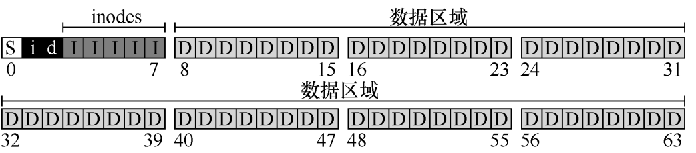

# 文件系统的实践
我们需要弄清楚：磁盘上的哪些结构存储文件系统的数据和元数据？当一个进程打开一个文件时会发生什么？在读取或写入期间访问哪些磁盘结构？

## 文件系统不是目录！！！
文件系统指的是在硬盘等存储结构上如何组织和管理数据的方法。

## 文件系统和操作系统的关系

系统盘包括：
    根文件系统（包括很多重要的目录，内核就在/boot目录）
    GRUB启动程序

**整个操作系统安装流程也和文件系统离不开关联**：

**分区磁盘**：使用工具对磁盘进行分区。
**格式化分区**：将分区格式化为独立的文件系统。 这也是为什么装系统需要格式化的原因。
**挂载分区**：将格式化后的分区挂载到合适的挂载点。
**创建目录结构并复制文件**：在挂载的分区上创建必要的目录，并复制操作系统文件。
**配置文件系统表（/etc/fstab）**：确保系统启动时能自动挂载其他文件系统。
**安装引导加载程序**：配置引导加载程序以便系统能够正确启动。

## 硬盘上数据的整体组织

首先占大头的是用户数据，即数据区域。

同时文件系统还要记录每一个系统的元数据（创建时间，执行权限等等），因此我们还需要一个inodes区，存储着文件的inode信息。同时呢，这个inodes区的大小同时决定着可存储的文件数量（inodes和文件一一对应）

其次就是对应快速查找空闲数据区域和inode的区域。最后就是存储着整个文件系统信息的super区，超级块包含关于该特定文件系统的信息，包括例如文件系统中有多少个 inode 和数据块（在这个例子中分别为 80 和 56）、inode 表的开始位置（块 3）等等。

## Inodes组织
**inode** 是许多文件系统中使用的通用名称，用于描述保存给文件的元数据的结构，例如其长度、权限以及其组成块的位置。

Inode**最关键的问题是怎么指向数据块？**
- 最简单的使用指针和多级指针。 使用指针直接指向数据块的磁盘块，但是如果文件过大，直接指针无法胜任，此时需要多级指针（间接指针指向一个指针块，这个指针块全是直接指针）
- 第二种方式是指针加范围，但是呢因为很多时候文件在磁盘中非连续的，这种方式受限。

因此一般inode都包含多个直接指针和少量的间接指针。

## 目录
目录被文件系统视为特殊的文件，它包含了一对二元组（Inode 和 文件名字）的列表。因此也有自己的inode和数据块

## 读取文件
读取文件使用open调用，这其中发生了什么呢？

例如需要读取“/bar/foo”这个目录，文件系统会首先找到根目录的inode号，再去对应的数据块（存储着目录信息）中遍历去查找这个foo文件对应的inode号，再根据inodes区和inode号找到对应的目录信息打开。  最后一步将对应的inode信息加载进内存，返回文件描述符。

打开后使用Read调用就完成读取

## 写入磁盘
写入文件需要给文件追加分配磁盘块，因此有五个IO，很麻烦。（一个读取数据位图（然后更新以标记新分配的块被使用），一个写入位图（将它的新状态存入磁盘），再是两次读取，然后写入 inode（用新块的位置更新），最后一次写
入真正的数据块本身。）

## 缓存和缓冲
如上述：打开和写入文件有大量的IO操作，因此文件系统通常使用DRAM来缓存重要的目录

读缓冲是很有效的，但是写操作不可避免到要通过IO持久化到硬盘。 写缓冲一般是5-30s。 这样对一个文件写操作时可以减少位图的IO，提高性能。

# FAT文件系统存储详解

## 1. 基本结构

FAT文件系统主要由三个部分组成：
- **引导扇区（Boot Sector）**
- **文件分配表（File Allocation Table，简称FAT）**
- **根目录和数据区**

### 1.1 引导扇区

引导扇区是磁盘的第一个扇区，包含以下信息：
- **引导代码**：用于启动操作系统的代码。
- **BPB（BIOS Parameter Block）**：包含文件系统的基本参数，如每扇区字节数、每簇扇区数、保留扇区数、FAT表的数量、根目录项数等。

### 1.2 文件分配表（FAT）

文件分配表是FAT文件系统的核心部分，它是一个索引表，记录了文件在磁盘上的存储位置。每个文件和目录在FAT中都有一个条目，条目中包含了文件的起始簇号和后续簇的链表。

FAT表的每个条目对应一个簇，条目的值表示簇的状态：
- **0x0000**：表示该簇是空闲的。
- **0xFFF8 - 0xFFFF**：表示该簇是文件的最后一个簇。
- **其他值**：表示文件的下一个簇的簇号。

FAT表可以有多个副本（通常是两个），以提高数据可靠性。

### 1.3 根目录和数据区

根目录紧跟在FAT表之后，包含根目录下的文件和子目录的目录项。每个目录项包含以下信息：
- **文件名**
- **扩展名**
- **属性**（如只读、隐藏、系统文件等）
- **起始簇号**
- **文件大小**
- **时间戳**（创建时间、修改时间等）

根目录的大小是固定的，FAT16的根目录最多可以包含512个目录项，而FAT32的根目录大小是可变的。

数据区紧跟在根目录之后，包含所有文件和子目录的实际数据。数据存储在固定大小的簇中，簇的大小在格式化时确定。

## 2. 文件和目录的存储

### 2.1 文件存储

当一个文件被存储在FAT文件系统中时，文件的数据被分成多个簇，每个簇的大小是固定的。文件的第一个簇号存储在目录项中，后续簇的簇号存储在FAT表中。

例如，假设一个文件占用三个簇，簇号分别为2、3和4，那么：
- 目录项中存储起始簇号2。
- FAT表中，簇2的条目值为3，簇3的条目值为4，簇4的条目值为0xFFFF（表示文件结束）。

### 2.2 目录存储

目录在FAT文件系统中也被视为特殊类型的文件。目录的第一个簇号存储在父目录的目录项中，目录的内容存储在数据区中。

目录的内容是一个目录项的列表，每个目录项包含文件名、起始簇号和其他属性。子目录的目录项中包含子目录的起始簇号，子目录的内容存储在数据区中。

## 3. 文件名和长文件名

FAT文件系统对文件名长度有限制：
- **FAT16**：最多8个字符的文件名和3个字符的扩展名（8.3格式）。
- **FAT32**：支持长文件名（最多255个字符），通过在目录项中使用多个条目来存储长文件名。

## 4. 优缺点

### 优点
- **简单**：FAT文件系统的结构简单，易于实现和维护。
- **兼容性好**：几乎所有的操作系统都支持FAT文件系统。

### 缺点
- **元数据支持有限**：FAT文件系统对文件权限、时间戳等元数据的支持有限。
- **文件名长度受限**：FAT16的文件名长度受限，FAT32虽然支持长文件名，但实现较为复杂。
- **不支持日志功能**：FAT文件系统不支持日志功能，因此在系统崩溃后恢复文件系统的一致性较慢。

快速格式化：重置文件系统的元数据结构（包括FAT表），但不会清除数据区中的实际数据。

完全格式化：重置文件系统的元数据结构，并且清除或重写数据区中的实际数据。
   

