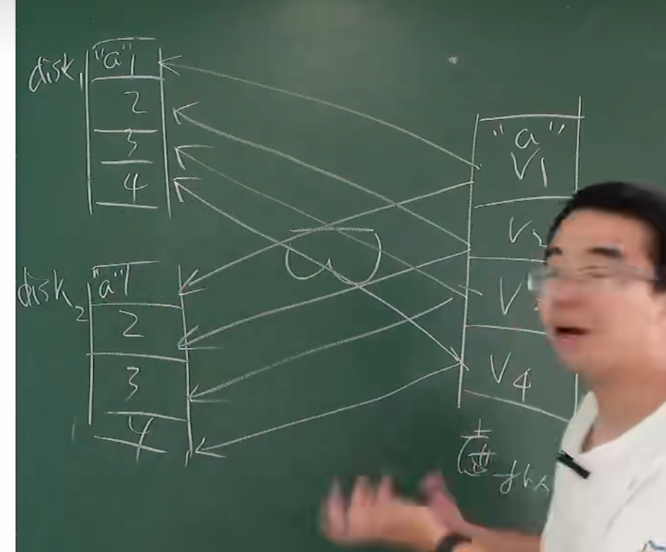
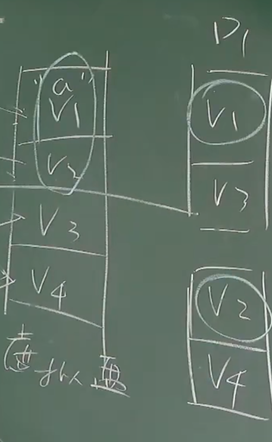
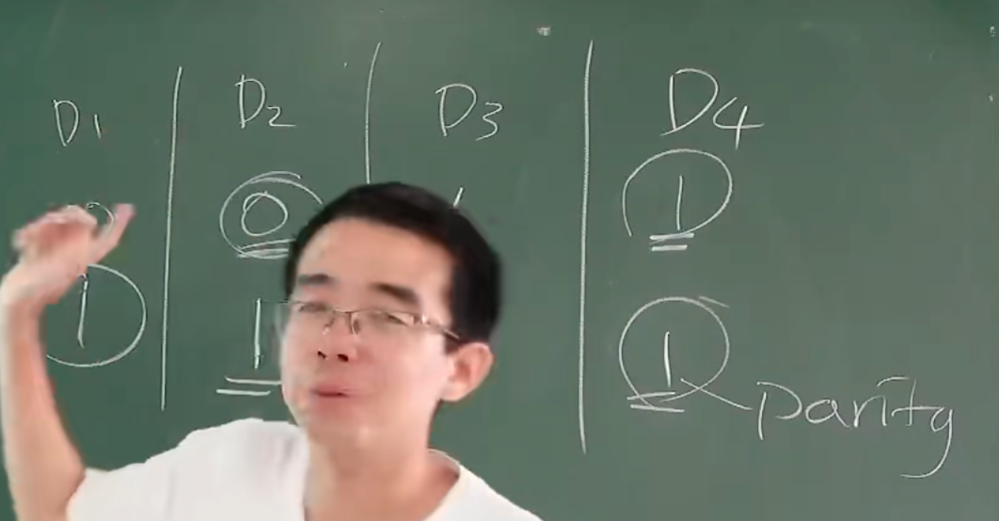
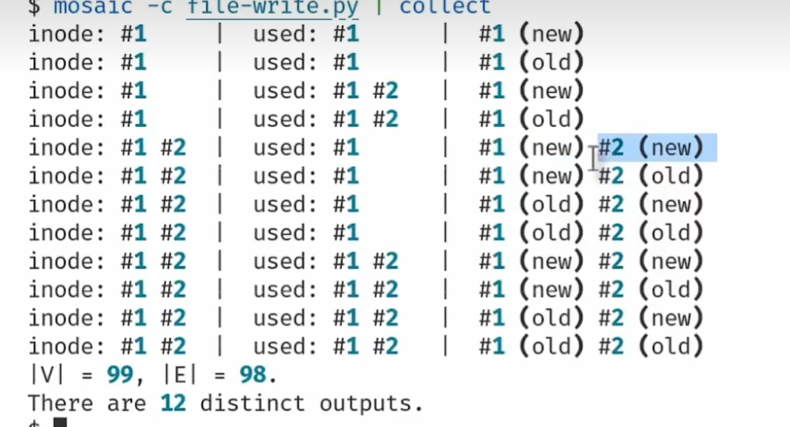
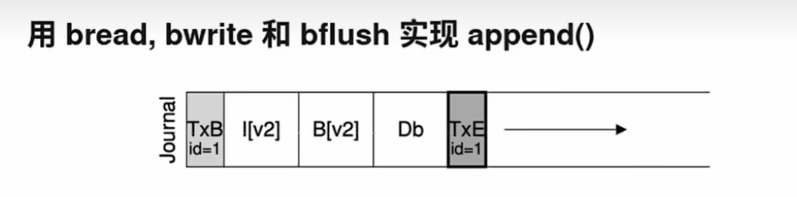

# 没有完全可靠的存储设备

当存储设备在辐射噪声，热噪声下不可避免的发生比特翻转，不可靠

硬盘物理损坏也是必然会发生的，支付宝的存储设备必然每时每刻都在发生，因为使用了大量的存储设备，尽管概率小。

#  RAID
把多个不可靠的盘虚拟成一个可靠且高速的虚拟盘，**这样当某个硬盘坏了，拔出来丢掉就是，数据不损失**。（RAID）

RAID是**反向的虚拟化**，我们的虚拟化一般都是把一个看成多个（进程的虚拟化：假设每一个虚拟化都有独立的CPU；内存的虚拟化：内存地址虚拟化，假设每个都有独立连续的地址空间。文件系统虚拟化：一个ssd虚拟成多个块），但是RAID是把多个磁盘看做一个磁盘。

## RAID的容错 RAID-1 系统

RAID本质就是虚拟盘块号和磁盘块号的映射。
当我们实现虚拟盘的信息并行存储再多个磁盘上时，我们可以实现坏了的磁盘随时扔，可以实现容错。

## RAID-0 更大更快

当我们把两个小磁盘组成一个大的虚拟盘时，同时使用交错排列我们可以实现容量大且速度快（因为读取磁盘可以并行）

# RAID的最终方案
根据上述的RAID-0 RAID-1 可知它们都无法兼顾不浪费空间和容错。此时RAID提出了终极方案：
前提条件： 
 - 不会有两个盘同一时间发生损害，失效。
 - 数据间的异或交换律就可以实现恢复损失的数据

**我们使用一块盘来存储所有数据盘的每一个位置的异或值。**
  
  

但是随之而来的问题时大量的IO问题，**每次修改数据，我们都要修改对应的异或盘**。这样有性能的问题且同时呢缩短了异或盘了的使用价值。

解决方案就是：
把异或值（奇偶校验值）均匀存储再每一个盘上，要每一个盘时数据盘的同时也是异或盘。

# 崩溃一致性（写程序）

操作系统一直再给我们兜底。
如果我们更新文件到一半，突然发生了断电呢？答案时这个文件的数据可能会丢失。  但是我们希望我们宝贵的文件要么全更新，要么全不更新。

出现很多不一致性：
inode --- map --- data

这就是为什么都提示更新中请勿关机的原因。
有需求，就有人解决：FSCK

FSCK 就是再不断的移动指针，试图去恢复文件系统。
但是FSCK本身时复杂的，难实现的。 同时发现再FSCK时如果再发生断电，文件系统将彻底混乱。 

最好的方法还是要**原子的完成数据**的写入（All or nothing）：
写数据分为三步：写Log，写数据，等待数据落盘后删除LOG

首先磁盘会有一个Log区域记录此次写入数据的操作：

从TXBegin开始，此时如果crash了，因为没对数据有操作，没影响。
其次来执行数据操作了，如果数据操作没有全部完成（没有返回TXend  那么下次恢复后会重新Redolog 重新执行）
返回Txend后，删除Log

