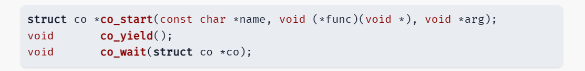

# 协程库


你可能会问：为什么我们需要这些 void 指针？好好，答案很简单：将 void 指针作为函数的参数 start_routine，允许我们传入任何类型的参数，将它作为返回值，允许线程返回任何类型的结果。


# Makefile
    $@ : 目标
    $^ : 所有依赖项
    $< : 第一个依赖项

    .PHONY : Clean :防止目录下正好有一个文件名叫clean。导致clean命令执行不了。

# 共享库

当linux代码中没有main函数，它不会编译成可运行的二进制文件，而是会生成共享库（动态链接库） libco.so

编译：
```
$(NAME)-64.so: $(DEPS) # 64bit shared library
    gcc -fPIC -shared -m64 $(CFLAGS) $(SRCS) -o $@ $(LDFLAGS)
```

其中 -fPIC -fshared 就代表编译成位置无关代码的共享库。除此之外，共享库和普通的二进制文件没有特别的区别

# 使用动态链接库

编译：
```
gcc -I.. -L.. -m64 main.c -o libco-test-64 -lco-64
gcc -I.. -L.. -m32 main.c -o libco-test-32 -lco-32
```

-   -I 选项代表 include path，使我们可以 #include <co.h>。你可以使用 gcc --verbose 编译看到编译器使用的 include paths。
-   -L 选项代表增加 link search path。
-   -l 选项代表链接某个库，链接时会自动加上 lib 的前缀，即 -lco-64 会依次在库函数的搜索路径中查找 libco-64.so 和 libco-64.a，直到找到为止。如果你将 libco-64.so 删除后用 strace 工具查看 gcc 运行时使用的系统调用，就能清晰地看到库函数解析的流程；
  
```
LD_LIBRARY_PATH=.. ./libco-test-64

```
如果不设置 LD_LIBRARY_PATH 环境变量，你将会遇到 “error while loading shared libraries: libco-xx.so: cannot open shared object file: No such file or directory” 的错误。

LD_LIBRARY_PATH 是一个环境变量，用于在程序运行时指定动态链接库（共享库）的搜索路径。当你运行一个程序，而它需要加载动态链接库时，系统会首先在 LD_LIBRARY_PATH 指定的目录中查找这些库。

如果不设置 LD_LIBRARY_PATH，系统将只在默认的库路径（如 /lib 和 /usr/lib）中搜索所需的共享库。如果你的库文件不在这些默认路径中，比如在一个本地目录或者其他非标准位置，你就需要设置 LD_LIBRARY_PATH 来包含这些目录，否则程序在尝试加载库时会报错，提示无法找到共享对象文件


# 汇编

## 基础知识
在计算机科学中，“位”（bit）是最基本的数据单位，代表一个二进制数字，即0或1。每8个位组成一个字节（Byte），是存储和处理信息的基本单位。

“16位”和“32位”通常指的是计算机处理器的字长，即CPU一次能处理的数据的位数。16位处理器一次可以处理16位的数据，而32位处理器可以处理32位的数据。这影响了计算机的性能和能处理的内存量。例如，32位计算机的字长是32位，通常意味着它可以使用的最大内存是4GB。2^32

x86架构是一种广泛使用的计算机处理器架构，最初由Intel开发。它以Intel的8086处理器命名，该处理器是16位的。随后，这个架构发展为32位（IA-32）和64位（x86-64或AMD64）。x86架构以其复杂指令集计算（CISC）而闻名，提供了丰富的指令集来执行各种操作。这种架构主要用于个人电脑和服务器，并且支持Windows、macOS和Linux等多种操作系统。

## 寄存器
- %rbp（基指针寄存器）：在函数调用中，%rbp通常用于存储栈帧的基地址，它是访问函数参数和局部变量的参考点。
- %rbx（基址寄存器）：%rbx是一个通用寄存器，通常用于在程序中保存一个值，以便后续使用。在协程或函数中，它可能被用来保存一个状态或者一个重要的中间值。
- %rsp（栈指针寄存器）：%rsp指向当前的栈顶。当你执行sub $0x8, %rsp时，实际上是在栈上为局部变量或临时数据分配空间。
- %rdi（目的索引寄存器）：在函数调用的参数传递中，%rdi通常用于存储第一个参数的值。
- %rsi（源索引寄存器）：%rsi通常用于存储第二个参数的值。
- %rax（累加器寄存器）：%rax是最常用的寄存器之一，用于存储函数的返回值或者进行算术运算的结果。
- %rbx（基址寄存器）：在汇编语言中，%rbx 是一个通用寄存器，通常用于数据存储。它是一个被调用者保存（callee-saved）寄存器，意味着如果一个函数调用了另一个函数（子函数），那么这个子函数在使用 %rbx 之前需要先保存其原始值，并在使用后恢复，以保证调用者（父函数）的 %rbx 值不会被改变。在您的代码中，如果 %rbx 被用作循环计数器，它可能被用来存储循环的迭代次数或跟踪某个过程的执行次数，如 printf 函数调用的次数。这是 %rbx 的典型用途之一，因为它的值在函数调用之间是保持不变的。
  
- %eax（累加器寄存器的低32位）：在调用可变参数的函数（如printf）之前，%eax通常被清零，以表示没有使用浮点数寄存器传递参数。


在x86-64架构的调用约定中，当调用一个可变参数的函数（比如printf），整数和浮点数参数通常是通过不同的寄存器传递的。整数参数通过通用寄存器传递，而浮点数参数则通过XMM寄存器传递。这种区分是为了优化性能，因为整数和浮点数在处理器内部是以不同的方式处理的。

对于可变参数的函数，调用者（即调用函数的代码）不知道被调用的函数将接收多少个参数，以及这些参数的具体类型。因此，x86-64调用约定规定，在调用可变参数的函数之前，必须在%al（%rax的低8位）中设置传递给函数的浮点参数的数量。这样，被调用的函数就知道应该从哪些XMM寄存器中获取浮点数参数。

然而，当函数不接收任何浮点参数时，%al应该被清零，这样被调用的函数就知道不需要从XMM寄存器中获取参数。在您的代码中，xor %eax, %eax这条指令就是用来清零%eax的，由于%al是%eax的一部分，这也间接清零了%al，告诉printf函数没有浮点数参数传递。


## 汇编代码流程的理解
当一个函数被调用时，计算机确实会为这个函数创建一个新的栈帧。这个栈帧包含了函数的局部变量、参数以及返回地址。在函数执行之前，当前的基指针（%rbp）和其他必要的寄存器（如 %rbx）的值会被压入栈中，以便在函数执行完毕后能够恢复这些值。

这里的关键点是，push 指令用于将寄存器的值保存到栈中，而 pop 指令则用于从栈中取出这些值。当我们说 pop 是为了读取原始值时，我们指的是在函数执行过程中可能会改变寄存器的值，所以我们需要在函数开始时保存这些原始值（通过 push），并在函数结束时恢复它们（通过 pop）。

例如，如果 %rbx 在函数开始时被压入栈中，那么无论函数内部如何使用和修改 %rbx，当函数准备返回时，通过 pop %rbx 指令就可以恢复 %rbx 的原始值。这样，当控制权返回到调用者时，调用者会发现 %rbx 的值和它调用函数之前的值是一样的，这保证了程序的正确性和一致性。

所以，pop 操作不仅仅是为了从栈中取出数据，更重要的是为了恢复寄存器在函数执行之前的状态，确保函数的调用和返回不会对程序的其他部分产生不良影响。

```
push   %rbp             ; 将基指针寄存器（rbp）的值压入栈中，保存当前函数的栈帧
push   %rbx             ; 将bx寄存器的值压入栈中，保存寄存器的值，因为它可能会在协程中被修改
lea    <stdout>, %rbp   ; 将标准输出的地址加载到基指针寄存器（rbp）中
xor    %ebx, %ebx       ; 将bx寄存器清零，这通常用于初始化寄存器
sub    $0x8, %rsp       ; 将栈指针（rsp）减8，为局部变量分配空间
mov    %ebx, %esi       ; 将bx寄存器的值移动到源索引寄存器（esi），准备作为printf的参数
mov    %rbp, %rdi       ; 将基指针寄存器（rbp）的值移动到目的索引寄存器（rdi），准备作为printf的参数
xor    %eax, %eax       ; 再次将累加器寄存器（eax）清零，因为printf是可变参数函数，eax用于指示传递的xmm寄存器数量
callq  <printf@plt>     ; 调用printf函数打印输出
inc    %ebx             ; 将bx寄存器的值增加1，通常用于循环计数
xor    %eax, %eax       ; 再次将累加器寄存器（eax）清零，准备下一次函数调用
callq  <co_yield>       ; 调用协程yield函数，暂停当前协程的执行并保存状态
cmp    $0x3e8, %ebx     ; 将bx寄存器的值与1000（0x3e8）比较
jne    669 <foo+0xf>    ; 如果bx寄存器的值不等于1000，则跳转到标签foo+0xf处继续执行
pop    %rax             ; 将之前压入栈中的ax寄存器的值弹出，恢复寄存器的值
pop    %rbx             ; 将之前压入栈中的bx寄存器的值弹出，恢复寄存器的值
pop    %rbp             ; 将之前压入栈中的基指针寄存器（rbp）的值弹出，恢复栈帧
retq                   ; 从函数返回

```

---

# co_yeid 的实现

## 重点
我们把当前寄存器的数据，包括stakc pointer都保存下来，然后恢复别的协程的寄存器数据和stack pointer就完成了任务。

我们可以为线程 (或协程) 在内存中分配堆栈，让 Stack Pointer 指向各自分配的堆栈中。那么，我们就只要保存寄存器就可以了

## 实现
在x86架构的汇编语言中，当执行 call 指令调用一个函数时，call 指令会自动将当前的指令指针（即返回地址）压入栈中，并将控制权转移到被调用函数的起始地址。这个压入栈中的返回地址就位于栈顶。当被调用的函数执行完毕后，它会通过 ret 指令从栈顶弹出返回地址，并将控制权转移回该地址，也就是调用函数中 call 指令之后的位置

### setjmp
当你调用 setjmp 时，它会保存当前的执行环境（包括程序计数器、栈指针等）到一个类型为 jmp_buf 的缓冲区中。如果直接从 setjmp 返回，它返回 0。如果稍后通过 longjmp 跳转回来，setjmp 会返回 longjmp 提供的非零值

- 在 co_yield() 被调用时，setjmp 保存寄存器现场后会立即返回 0，此时我们需要选择下一个待运行的协程 (相当于修改 current)，并切换到这个协程运行。
- setjmp 是由另一个 longjmp 返回的，此时一定是因为某个协程调用 co_yield()，此时代表了寄存器现场的恢复，因此不必做任何操作，直接返回即可。

### Wrapper 函数
包装函数，它可以在func函数（被包装函数）使用前后添加代码，而不用改变func本身的代码。
种技术在软件工程中非常常见，尤其是在需要增强现有函数功能、管理资源、处理错误或进行权限控制时。

```
void coroutine_wrapper(void (*func)(void *), void *arg) {
    // 在协程函数执行前可以添加代码，比如资源分配

    func(arg); // 调用实际的协程函数

    // 在协程函数执行后可以添加代码，比如资源回收
}

```

所以在我们使用Wrapper的目的是：
通过使用wrapper函数，您可以确保这些资源在协程函数 func 返回后被正确地回收，即使 func 没有直接包含资源回收的代码。


### 资源泄露问题
如果我们协程结束后，我们就直接销毁了协程的栈内存等，那么如果我们不知道协程已经返回了呢？
我们在这种情况下会使用co_wait,这就是资源泄露。 use after free。

#### 解决办法：
如果 pthread_join 发生在线程结束后不久： 如果线程已经结束，调用 pthread_join 会立即返回，并且会回收线程所使用的资源。这是因为 pthread_join 会等待指定的线程终止，如果线程已经结束，那么 pthread_join 就能够立即完成其工作。
如果 pthread_join 发生在结束以后一段时间： 即使线程已经结束，只要没有对其进行 join 操作，线程的资源（如堆栈和线程描述符）不会被自动回收。如果您在线程结束后一段时间才调用 pthread_join，它仍然会成功，并且会回收线程资源。您不会得到 ESRCH 错误，除非您尝试 join 一个不存在的线程。
如果 pthread_join 发生在之后很久很久： 如果线程是 joinable 的，那么即使它已经结束很久，只要没有被 join 过，它的资源不会被回收。pthread_t 是一个可能被复用的值，但是在您调用 pthread_join 之前，系统不会复用该线程的标识符。只有在 join 操作之后，系统才可能将该标识符分配给新的线程。因此，只要您正确地使用 pthread_join，就不会出现 join 错误线程的情况。
关于 joinable 线程： 默认情况下，创建的线程是 joinable 的，这意味着它们在结束时不会自动释放资源。这样做的目的是允许其他线程通过 pthread_join 来收集线程的退出状态和确保资源被回收。如果一个 joinable 线程没有被 join，它的状态会一直保持为 zombie，直到被 join。

我们在wait函数进行释放内存。
