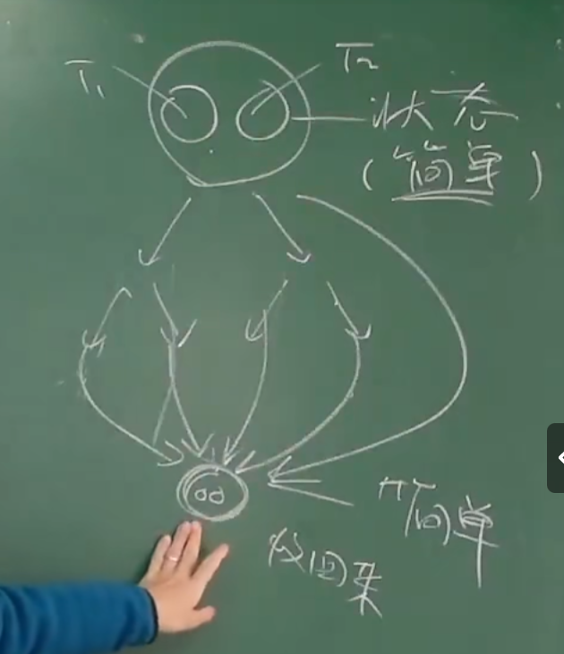
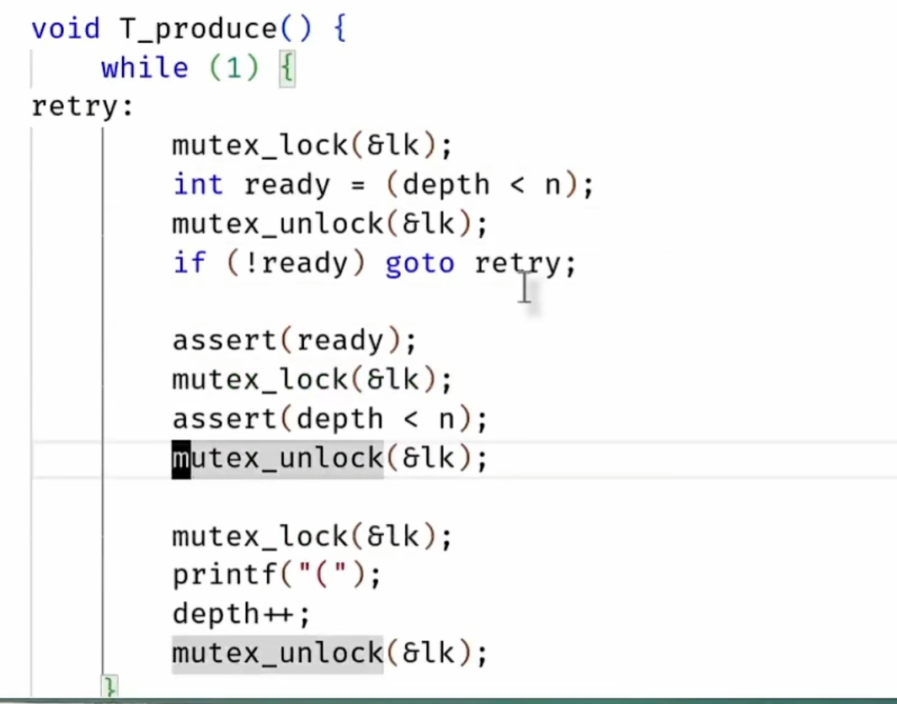
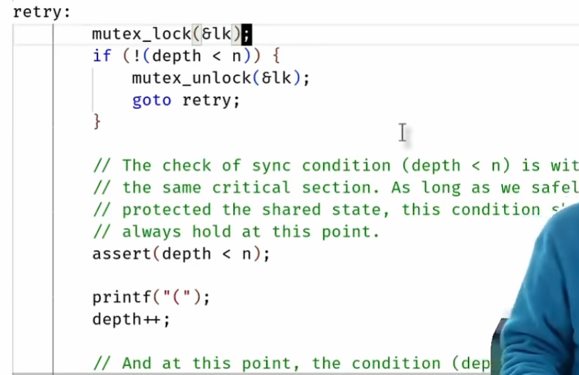

# 同步的必要性
互斥只实现了原子性，但是并没有关心顺序性。 于是同步出现了。但是特别多的时候，我们都需要有顺序的执行代码。

# 同步的概念
在某个瞬间到达“相互已知” 的状态。对未来或当前处于什么情况有一个预期。

先到先等状态：分散出去的线程，在某一个时刻统一，在条件达成的瞬间在此恢复并行。


无论线程如何调度，状态机如和转移，都会从初始状态到一个规定好的特定状态。
状态不会散开来。会进行收束。

状态机从一个已知的状态到另一个已知的状态。

## 乐队例子

**在任何时候我们打算访问共享变量的时候，我们都应该使用锁，把它保护起来。**


如上图所示，当我们从一个已知的状态进行某种操作后，我们明确线程们会经历一个状态，而且最终所有状态都会收束，到达一个新的特定状态。

所有线程当可执行的事情发生后在执行。

# 生产者，消费者问题  可解决百分九十的并行问题。

producer 和 consumer 共享一个人buffer。 producer负责像buffer里面放入“任务”，然后consumer会从buffer里拿出任务，然后执行。
现实例子： 老师布置作业

我们可以通过打印括号大法来检测我们的生产者和消费者是否正确。

**同步实现的重点是条件。当我们实现同步的时候，我们发现，几乎都是满足某个条件后执行。**

## producer 实现的坑


看似正常，但是当我们释放掉这个锁后，我们会发现，我们上一步检查的条件它不一定成立里，可能就在同一时间，别人填满了buffer。 那么我们改怎么办呢？
答案是自然想到延长上锁的时间。




但是自旋锁很浪费cpu，这样的实现我们不喜欢。

## 条件变量
我们知道，同步的重点就是执行条件。


这是条件变量的基本实现方法。可以解决百分百的同步问题。 即满足条件才能执行线程的任务，带着锁完成任务。

但是它需要不断自旋来判断是否满足条件，这很浪费cpu，我们能不能不retry来实现条件变量同步机制呢？

有大神实现了api，三个：
```
cond_wait(&cv,&lk); 这个线程进入等待模式，进入休眠模式，这样他就不占CPU。等待别人唤醒，并且带一个锁。

cond_signal(&cv); 唤醒在cv条件上进行等待的线程。 wake up a random thread;
cond_broadcast(&cv); wake up all thread;

```


### 核心代码
```
mutex_lock(&mutex);
while(!cond){
    wait(&cv,&mutex);
}

assert(cond);

mutex_unlock(&mutex);
```
当我们的竞争资源有了改动，就唤醒所有线程，告诉他们世界变了，自己再检查一下是否满足cond。

# 实现并发控制
