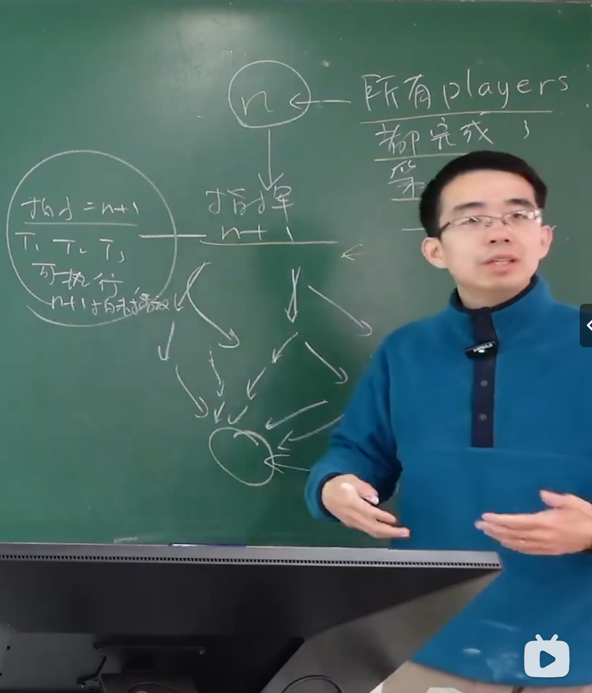
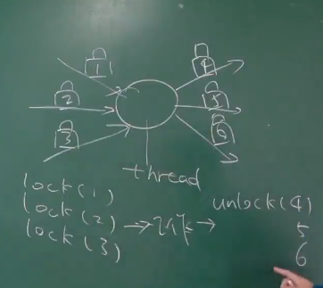
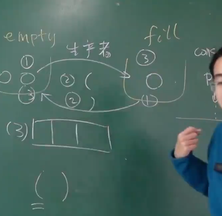
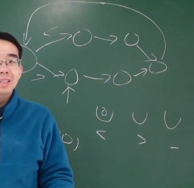
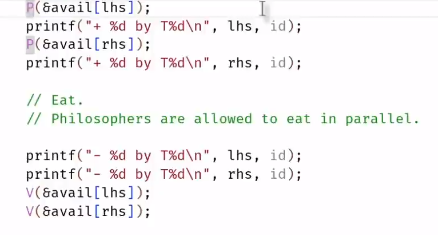

# 同步的必要性
互斥只实现了原子性，但是并没有关心顺序性。 于是同步出现了。但是特别多的时候，我们都需要有顺序的执行代码。

# 同步的概念
在某个瞬间到达线程之间“相互已知” 的状态。对未来或当前处于什么情况有一个预期。（在当前线程满足条件后，执行任务后，当前线程就知道是否要休息了，有哪一些线程满足条件要工作了）

先到先等状态：分散出去的线程，在某一个时刻统一，在条件达成的瞬间在此恢复并行。

同步的本质是线程需要等待某件它所预期的事件发生，而事件的发生总是可以用条件 (例如 depth 满足某个条件，或是程序处于某个特定的状态) 来表达。因此计算机系统的设计者实现了条件变量，将条件检查和临界区 “放在一起”，以实现线程间的同步


无论线程如何调度，状态机如和转移，都会从初始状态到一个规定好的特定状态。
状态不会散开来。会进行收束。

状态机从一个已知的状态到另一个已知的状态。

## 乐队例子

**在任何时候我们打算访问共享变量的时候，我们都应该使用锁，把它保护起来。**


如上图所示，当我们从一个已知的状态进行某种操作后，我们明确线程们会经历一个状态，而且最终所有状态都会收束，到达一个新的特定状态。

所有线程当可执行的事情发生后在执行。

# 生产者，消费者问题  可解决百分九十的并行问题。

producer 和 consumer 共享一个人buffer。 producer负责像buffer里面放入“任务”，然后consumer会从buffer里拿出任务，然后执行。
现实例子： 老师布置作业

我们可以通过打印括号大法来检测我们的生产者和消费者是否正确。

**同步实现的重点是条件。当我们实现同步的时候，我们发现，几乎都是满足某个条件后执行。**

## producer 实现的坑


看似正常，但是当我们释放掉这个锁后，我们会发现，我们上一步检查的条件它不一定成立里，可能就在同一时间，别人填满了buffer。 那么我们改怎么办呢？
答案是自然想到延长上锁的时间。


但是自旋锁很浪费cpu，这样的实现我们不喜欢。

## 条件变量
我们知道，同步的重点就是执行条件。


这是条件变量的基本实现方法。可以解决百分百的同步问题。 即满足条件才能执行线程的任务，带着锁完成任务。

但是它需要不断自旋来判断是否满足条件，这很浪费cpu，我们能不能不retry来实现条件变量同步机制呢？

有大神实现了api，三个：
```
cond_wait(&cv,&lk); 这个线程进入等待模式，进入休眠模式，这样他就不占CPU。等待别人唤醒，并且带一个锁。

cond_signal(&cv); 唤醒在cv条件上进行等待的线程。 wake up a random thread;
cond_broadcast(&cv); wake up all thread;

```


### 核心代码
```
mutex_lock(&mutex);
while(!cond){
    wait(&cv,&mutex);
}

assert(cond);

mutex_unlock(&mutex);
```
当我们的竞争资源有了改动，就唤醒所有线程，告诉他们世界变了，自己再检查一下是否满足cond。

---

# 实现并发控制

不管三七二十一，同步先上锁。上锁后检查同步条件满不满足。 不满足就wait，如果满足就对应的操作加unlock。

## 拓扑排序
实现并发控制的本质就是把一个运算量大的任务分解成如果个子问题，联合多个处理器处理。

问题和问题之间有依赖关系，构成有向无环图。
生产者的任务就是每次对这个有向无环图进行拓扑排序，确保每个人物在其依赖的任务后面执行。

拓扑排序的基本思想是这样的：

从DAG中选择一个没有前驱（即入度为0）的顶点并输出。
从图中删除该顶点和所有以它为起点的有向边。
重复步骤1和2，直到所有顶点都被输出，或者图中不再存在入度为0的顶点（这意味着图中存在环，因此无法进行拓扑排序）。
这个过程中，每次输出的顶点就是可以立即执行的任务，因为它不依赖于其他任务。通过这种方式，拓扑排序可以帮助确定任务的执行顺序，确保每个任务只在其所有前置任务完成后才开始执行。

生产者把任务放在buffer里面，然后消费者就在buffer里取任务run。

## 条件变量
有向无环图中，每个任务节点运行的条件就是所依赖的任务就已经完成。
我们可以当一个任务完成后，就可以唤醒所有任务，检查一下自己的条件是否满足了。


## 如何判断能不能并行
当调度速度较快（遍历整个图只要几微秒，但是每个任务消费者运行要几s就可以。
如果任务之间完全依赖上一个任务算出来的结果，那么这个任务就不好并行。


____

# 信号量的发明

我们的计算任务可以抽象成一个流程图，但是我们把每一个节点的入边都上锁。
当我们一开始都把锁给lock，当这个任务的所依赖的任务都执行完后,再unlock这个锁，执行这个任务。

具体实现：
    每个节点任务开始的时候，先把入度边给锁了。 然后执行任务，完成任务后就把出度边的锁给释放。

相当与用锁实现了拓扑排序了。这就是用互斥锁实现了一个release和acquire之间的同步。（即事件发生的因果关系，当上一个线程unlock，我才能运行）



## 互斥锁的自然拓展
token：例子： 游泳馆手环。

我们是实现了用mutex实现同步，但是mutex有一个局限性：泳池这么大，用mutex就只能保证只有一个人在泳池里游泳池， 这很不正常。
于是 我们自然想到了可以记数的mutex，保障每次泳池都有三十个人以下在游泳。

信号量的操作本身是原子的。

这就是信号量。

信号量就是一个装球的袋子，sem_wait 就是在里面拿球，如果里面没有球了，就一直wait。sem_post 就是在里面放球。
互斥锁就是限制数量为1的信号量。（除了：在互斥锁中 A线程lock，B线程unlock 是不总被支持的 算是非法操作，但在信号量这是合法的）


# 信号量的使用

**当线程的同步可以用一个整数来表达同步条件的时候，我们就能用条件变量**
比如 线程的join， 我们使用一个全局变量count，当count的值为3（假设只有三个线程，线程结束就会count++）join完成。
此时，我们可以条件变量，每次结束后 sem_post, join函数里面可以sem_post 三次。

## 信号量与生产者消费者问题


在这个问题中，我们维护了两个信息量：empty 和 full；
empty表示buffer里面还有几个空位，full表示buffer里面有几个可以执行的任务。

生产者作的任务是：首先从empty这个口袋中取出球（没有球就等待），其次执行任务，最后在full这个口袋里放一个球（表示buffer里面多了个任务）。
消费这任务完全对称。


## 不适用场景
信号量不擅长表达二选一。
就拿上一节课的fish来说，从初始状态到分叉口决定打印什么的时候，如果用条件变量的方法，它就会同时唤醒两个满足条件的线程，要多个线程去抢锁，谁抢到了就选谁。 这个选择其实是抛给了操作系统，但是信号量需要程序员来自己调度。




# 信号量 vs 条件变量

**信号量**：
- 互斥锁的自然推广
- 干净的语法，优雅易读。没有条件变量的自旋，更加高效。

**条件变量**：
- 万能：适用于任何同步条件
- 不太好用：代码语法不优雅，冗余。

## 哲学家吃饭问题
如果用信号量：


程序可能会死锁，原因是 多个线程都同时举起了左边的叉子呢？ 那么大家右边都没有叉子了。此时程序彻底卡死。

但是用条件变量，线程们在拥有互斥锁的情况下同时举起两边的叉子和右边的叉子。此时绝对对。

### 信号量的解决办法
#### 赶一个人下桌
此时哲学家们肯定有两个人可以同时举起左右手，此时不会死锁。
实现 添加一个table信号量就行。
但是如果问题变得更加复杂呢？ 信号量很难解决。

#### 按一定规则取得筷子
此时信号量就相当于一个互斥锁。

而总是按照从小到大的顺序获得互斥锁，我们就不会死锁（挖坑）


## 我们用信号量去实现条件变量

条件变量 wait 的核心是的 unlock 在 sleep。

但是！！ **用信号量实现会有空隙 导致未知的bug**


