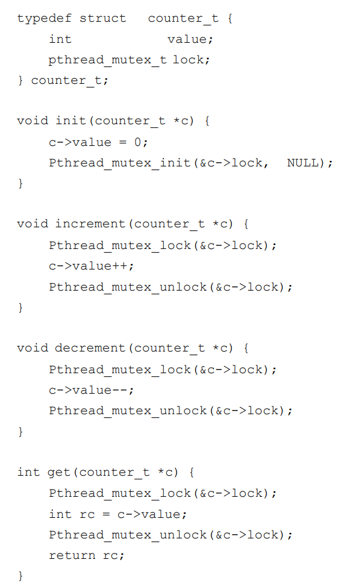
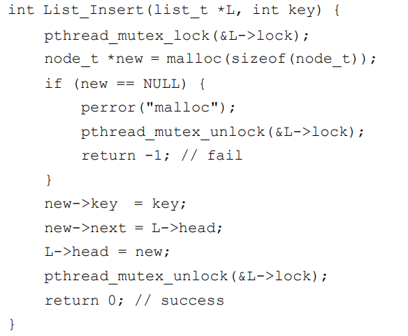
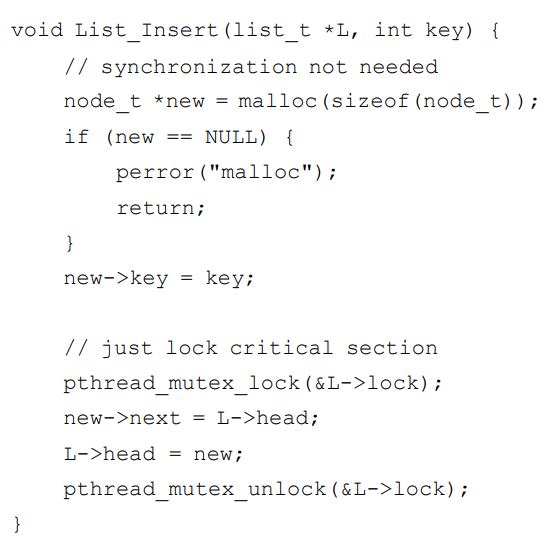
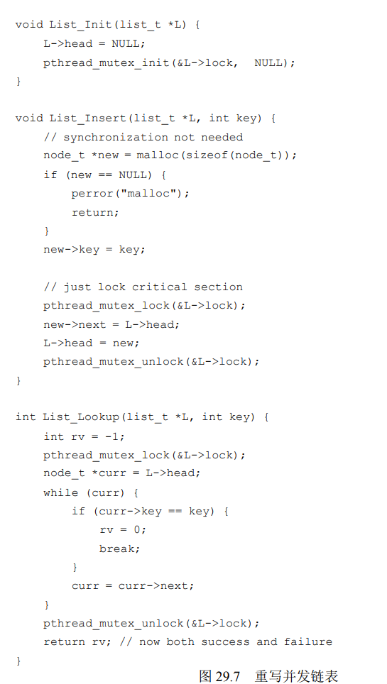

# 计数器
我们实现一个计数器的并发可以：

但实际上，这个实现性能比较差，和单线程程序比还慢了近五十倍。这主要是多个线程的竞争导致。
## 懒惰计数器
**懒惰计数器通过多个局部计数器和一个全局计数器来实现一个逻辑计数器**，其中每个CPU 核心有一个局部计数器。具体来说，在 4 个 CPU 的机器上，有 4 个局部计数器和 1 个全局计数器。除了这些计数器，还有锁：每个局部计数器有一个锁，全局计数器有一个。

每次线程要要增加计数，只需要在自己的线程上添加就行了，每次局部计数器到达一个阈值就会去争抢全局计数器，增加到全局计数器上。这样大部分时间线程不会竞争线程，性能很高，但是相应的，我们去读全局计数器就很可能不准。  
阈值越高，性能越好，准确性就越差。

懒惰计数器就是在准确性和性能之间折中。

---

# 并发列表
异常处理流发生概率很小，因此错误不常被发现。linux的内核补丁中有百分之四十是在优化异常处理流。 所以启示我们最好不要在异常处理流中进行复杂操作，如解锁等（可能你看着逻辑没问题但是就会出奇怪的问题）。

修改后：不在函数一开始就上锁，而是要锁围绕真正的临界区资源。

**在并发编程中最好只保持单一的返回路径，降低了忘记释放锁的可能性。**

并发列表的实现；

# 提示：当心锁和控制流
对并发代码和其他代码都有用，即注意控制流的变化导致函数返回和退出，或其他错误情况导致函数停止执行。因为很多函数开始就会获得锁，分配内存，或者进行其他一些改变状态的操作，如果错误发生，代码需要在返回前恢复各种状态，这容易出错。因此，最好组织好代码，减少这种模式。

# 并发队列
并发队列中，我们应该用两把锁分别控制列头和列尾，这样能有效较少锁的争抢和释放浪费的时间。

# 实现的注意事项
我们应该从易入难。实现并发的数据结构时，我们应该先用一把大锁实现，这样很可能是对的。。在此基础上在进行性能优化。

“一切不成熟的优化是坏事的根源”，linux也是一开始都用一把大锁（BKL）的，后来多处理器才过度到多个锁。

增加并发不是总能提示性能。

