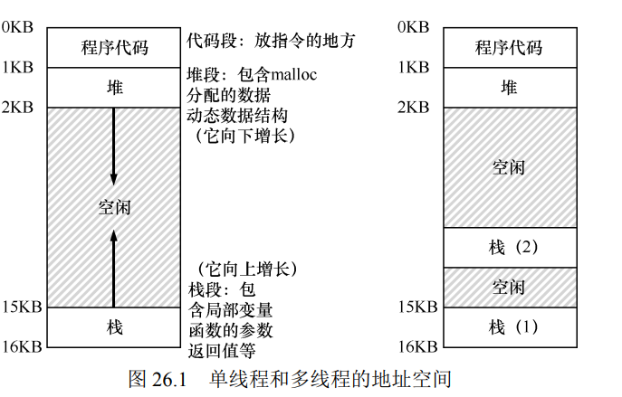

操作系统会自动把程序放在多线程上。

# 操作系统无时不刻都在进行进程的切换。
    因此多线程打印a，b 一定是交替打印的。

# 证明多线程之间拥有独立的堆栈（如何知道独立堆栈有多大）
    首先，我们需要一个指向函数运行时的内存指针。（我们可以定义一个局部变量，去局部变量的地址 就可以近似得到函数运行时的内存地址）

    其次，我们可以通过函数递归调用，不断的蚕食系统分配的堆栈空间，知道栈溢出，我们就可知道独立堆栈有多大。我们答应出函数运行的地址，可以证明拥有独立的堆栈。

# 多线程会打破原来程序的原子性
    以往编程的方法：把若干段系统调用直接简化或归纳为一段原子性的状态迁移（如排序）

    但是==多线程会破坏排序的数组==，导致破坏了原子性。
    

## 并发BUG
支付宝BUG

```
unsigned int balance = 100;

int alipay_withdraw(int amt){

    if(balance >= 100){

        usleep(1);//bug appear
        balance -= amt;
        return SUCEES;
    }else{
        return FAIL;
    }
}
```
当线程休息一秒后，另一个线程也能同时进入if语句。 那么两个都能对这个余额进行改动，导致重大错误。

##1+1都不会算了
    如果两个线程都在计算sum+1，但是sum可能会很小，总之不会正确。 这就是共享内存的弊端。
原因：i++ 这不是原子操作，它包含了从内存中读和写入内存的两个系统调用。 其中两个系统调用之间会被并发线程中断。

##共享内存推翻了编译器优化假设
    程序的行为在并发状态下变得不顺序了。
编译器是对并发无感知的——如果编译器假设每个变量的值都可能来自其他线程，那么可做的优化就会变得十分局限。

现代处理器可能会进行指令重排序、分支预测和乱序执行等高级优化，这些优化在某种意义上与编译器优化代码的方式相似。

# 阅读笔记

## 线程之间的条件变量

当线程之间必须发生某种信号时，如果一个线程在等待另一个线程继续执行某些操作，条件变量就很有用。

多个线程之间等待一个特定条件后继续运行。此时其他线程就需要休眠等待特定条件的发生。条件变量避免了等待特定条件下的CPU浪费和性能消耗。

## 检查返回值。
当然，任何 C 和 UNIX 的程序，都应该检查返回值，这里也是一样。否则会导致古怪而难以理解的行为，让你尖叫，或者痛苦地揪自己的头发。

## 并发的过程和内存分布
### 并发的过程
经典观点是一个程序只有一个执行点（一个程序计数器，用来存放要执行的指令），但多线程（multi-threaded）程序
会有多个执行点（多个程序计数器，每个都用于取指令和执行）。换一个角度来看，每个线程类似于独立的进程，只有一点区别：它们共享地址空间，从而能够访问相同的数据。


线程有一个程序计数器（PC），记录程序从哪里获取指令。每个线程有自己的一组用于计算的寄存器。所以，如果有两个线程运行
在一个处理器上，从运行一个线程（T1）切换到另一个线程（T2）时，必定发生上下文切换（context switch）。线程之间的上下文切换类似于进程间的上下文切换。对于进程，我们将状态保存到进程控制块（Process Control Block，PCB）。现在，我们需要一个或多个线程控制块（Thread Control Block，TCB），保存每个线程的状态。但是，与进程相比，线程之间的上下文切换有一点主要区别：地址空间保持不变（即不需要切换当前使用的页表）。

### 并发的内存分布

左边为单线程程序，右边为双线程程序。

### 并发的问题在于不可控的线程调度

## 必要术语

- 临界区（critical section）是访问共享资源的一段代码，资源通常是一个变量或数据结构。
- 竞态条件（race condition）出现在多个执行线程大致同时进入临界区时，它们都试图更新共享
   的数据结构，导致了令人惊讶的（也许是不希望的）结果。 
- 不确定性（indeterminate）程序由一个或多个竞态条件组成，程序的输出因运行而异，具体取
    决于哪些线程在何时运行。这导致结果不是确定的（deterministic），而我们通常期望计算机系统给出确
    定的结果。
- 为了避免这些问题，线程应该使用某种互斥（mutual exclusion）原语。这样做可以保证只有一
    个线程进入临界区，从而避免出现竞态，并产生确定的程序输出。