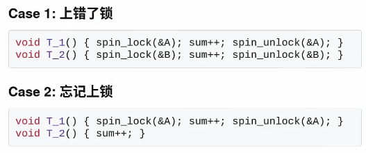
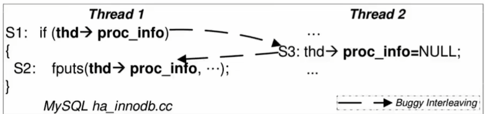
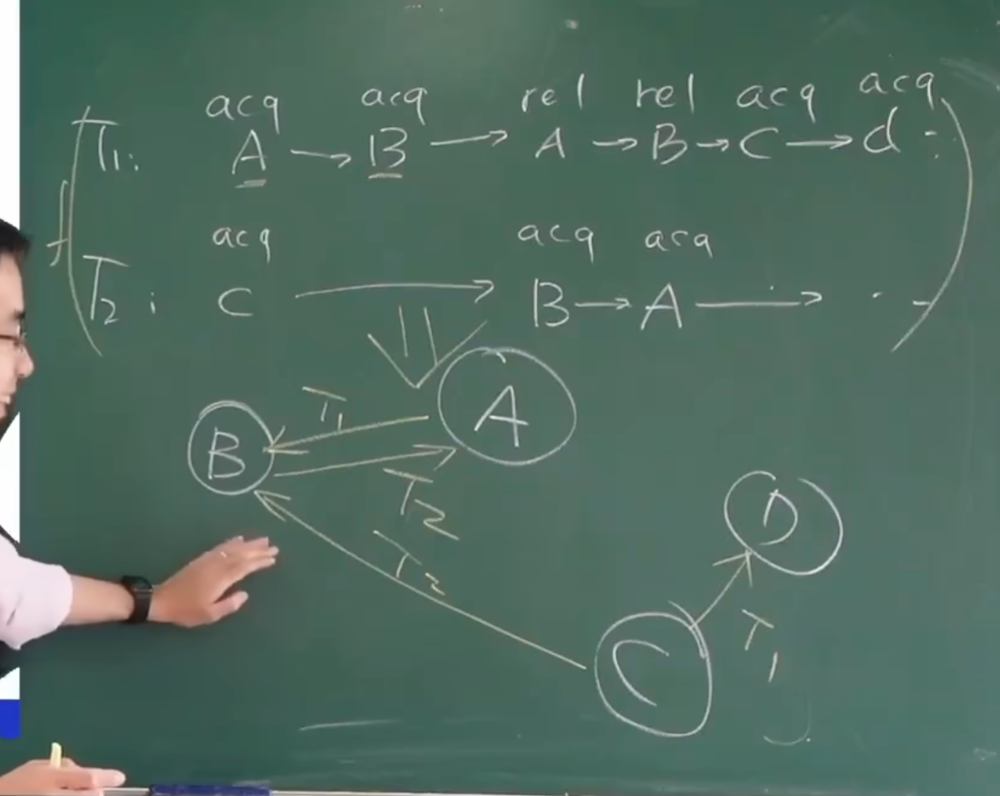
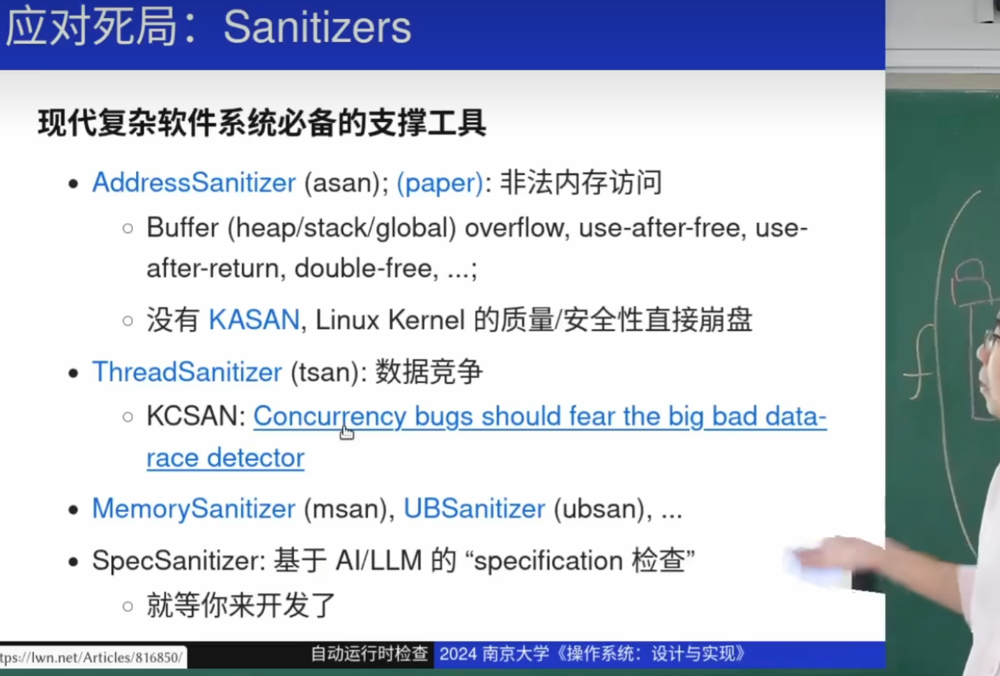
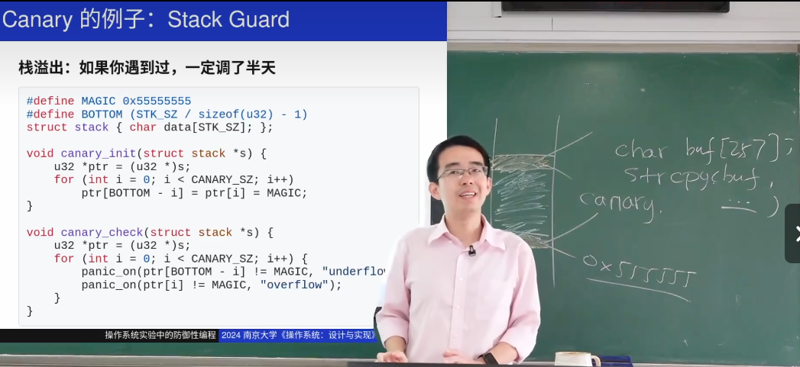

# 死锁
## ABBA 形死锁
哲学家吃饭问题
经典当A线程先lock 锁1，再lock锁2. B线程需要先lock 锁2，在lock锁1，那么这就会导致死锁。
最常见的死锁问题。


## 死锁产生的必要条件
- Mutual-exclusion :需要得到球才能继续
- Wait-for 得到球的人想要更多的球
- No-preemption 不能抢别人的锁，只能等待
- Circular-chain 循环等球

打破上面任意一个条件就能避免死锁。

## 解决方法：
### lock ordering
- 给所有锁都上编号，并且按照从小到大的顺序获取锁。这样有效避免死锁。原因是在lock ordering下，编号最大的那个锁总是可以运行的，然后释放，它的上一个锁就能运行了。 所以它保证了无论何时，至少有一个锁可以运行。


最后一个哲学家应该是先尝试获取编号最小的锁。在我们的例子中，如果哲学家3是最后一个哲学家，他应该先尝试获取锁1，然后是锁3。这样做确实可以避免死锁，因为它保证了无论何时都有一个线程在运行。如果都是先左手后右手，很有可能循环等待！

这里是正确的顺序：

哲学家1会先尝试获取锁1，然后是锁2。
哲学家2会先尝试获取锁2，然后是锁3。
哲学家3（最后一个哲学家）会先尝试获取锁1，然后是锁3。

**这样的话就不会循环等待，举例说明，如果哲学家3先拿到了1锁，那么哲学家1就会等待，这样无论哲学家3和哲学家2谁抢到了锁3都至少保证有一个线程会运行！！ 妙！**

```
#include <pthread.h>
#include <stdio.h>
#include <unistd.h>

#define NUM_PHILOSOPHERS 3

// 哲学家的锁（筷子）
pthread_mutex_t chopsticks[NUM_PHILOSOPHERS];

void* philosopher(void* num) {
    int id = *(int*)num;

    // 根据哲学家的编号，决定锁的获取顺序
    int left = id;
    int right = (id + 1) % NUM_PHILOSOPHERS;

    // 如果是最后一个哲学家，改变获取锁的顺序
    if (id == NUM_PHILOSOPHERS - 1) {
        left = right;
        right = id;
    }

    while (1) {
        printf("Philosopher %d is thinking.\n", id);
        sleep(1);

        // 尝试获取左边的筷子
        pthread_mutex_lock(&chopsticks[left]);
        printf("Philosopher %d picked up chopstick %d.\n", id, left);

        // 尝试获取右边的筷子
        pthread_mutex_lock(&chopsticks[right]);
        printf("Philosopher %d picked up chopstick %d.\n", id, right);

        // 吃饭
        printf("Philosopher %d is eating.\n", id);
        sleep(1);

        // 放下筷子
        pthread_mutex_unlock(&chopsticks[left]);
        printf("Philosopher %d put down chopstick %d.\n", id, left);

        pthread_mutex_unlock(&chopsticks[right]);
        printf("Philosopher %d put down chopstick %d.\n", id, right);
    }
    return NULL;
}

int main() {
    pthread_t philosophers[NUM_PHILOSOPHERS];
    int philosopher_numbers[NUM_PHILOSOPHERS];

    // 初始化锁
    for (int i = 0; i < NUM_PHILOSOPHERS; i++) {
        pthread_mutex_init(&chopsticks[i], NULL);
        philosopher_numbers[i] = i;
    }

    // 创建哲学家线程
    for (int i = 0; i < NUM_PHILOSOPHERS; i++) {
        pthread_create(&philosophers[i], NULL, philosopher, &philosopher_numbers[i]);
    }

    // 等待哲学家线程结束
    for (int i = 0; i < NUM_PHILOSOPHERS; i++) {
        pthread_join(philosophers[i], NULL);
    }

    // 销毁锁
    for (int i = 0; i < NUM_PHILOSOPHERS; i++) {
        pthread_mutex_destroy(&chopsticks[i]);
    }

    return 0;
}

```

# 数据竞争
data race ： 数据赛跑

两个线程在赛跑，导致不确定性的并发结果。
两个及以上的线程在同一时间访问同一内存，而且当至少一个操作是写操作时就是数据竞争。
## 造成数据竞争的常见情况
- 上错了锁
- 忘记上锁



## 解决办法
**用锁保护共享数据。消除一切竞争。**

# 原子性违反
## ABA 代码被别人强制插入

被人强行插入，打断了上锁的原子性。

以为不会出问题的地方往往会出问题，上了锁也有可能出现原子性违反。
实际是因为高压测试环境下，操作系统高负载的情况下线程会被中断导致错误。

# 顺序违反
use after free
也是因为中断导致的


# 应对并发BUG
## 死锁
死锁是比较简单的BUG
它有明确的规约，有明确的必要条件（上述的四个）

### 解决办法：lock ordering
解决了循环等待
### 死局
上锁我们主观想法是保证一段程序不会被打断，但是呢，我们实际运用锁的时候想要极致的性能，使用条件会更加复杂。
比如链表的操作：简单方法给链表上锁，这样不会出错。
但是我们如果想多个线程一起同时查询，新增节点呢以达到好的性能呢？   这很容易出错

==死局：复杂的系统和容易出错的人==

## 程序员的自救
在状态机运行的时候，打印运行日志

### 运行lock ordering 的检查


把每个线程的上锁记录下来，并把每个锁看做一个图中节点，连边。看图中是否有环，有环代表可能死锁

每个线程运行的过程中会不断地获得新的锁，也会不断地释放锁。 此时这个图就是动态的，是不断新增和删除的。

我们把同一行创造出来的锁，看做同一个锁节点。（工程师的智慧）


### 数据竞争的检查
用工具：编译命令后加 -fsanitize=thread(不是万能的，这可能检测不出来)

有用的工具：


## 防御性编程
我们可以多使用assert来缩短failure和error之间的距离

我们每次打印指针的值时，我们会发现每次打印都不一样的，这是因为内存的防御手段，随机性。Canary办法



栈溢出很难找到原因，用Canary可以快速测定时underflow 还是 overflow。 Canary即赋值一个初始值，程序结束后判断这个Cananry值是否改动，如果改动，说明栈溢出。 Cananry：随时准备牺牲的小白鼠

### 烫烫烫 和屯屯屯的原因：
烫烫烫是因为在内存中，没有初始化的栈内存是0xcccc，当我们栈溢出或者其他不标准的情况下，我们可能会访问未初始化的栈内存，这个oxccc国标解码就是烫烫烫。 屯屯屯就是对应的未初始化的堆内存