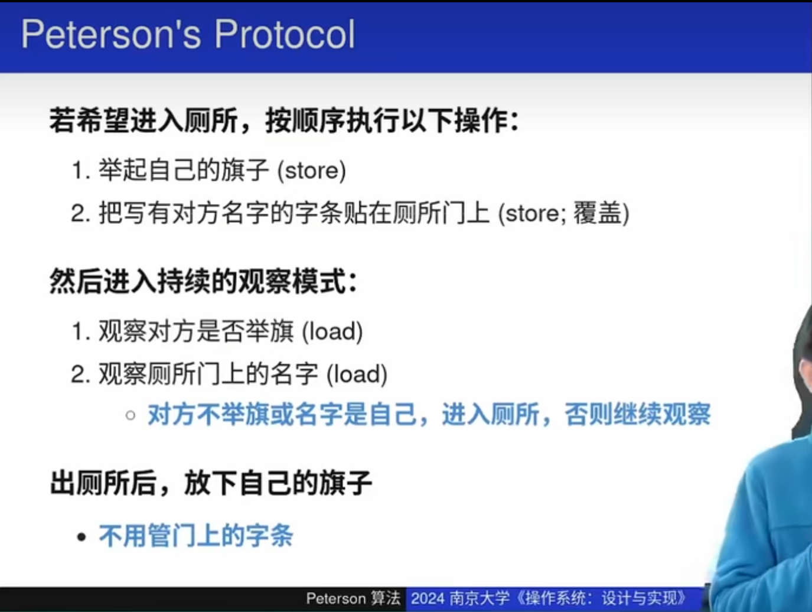
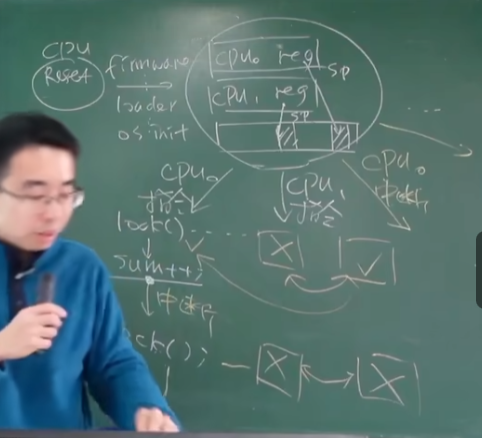

# 互斥

互斥本质是阻止并发，automic，使lock  -- unlock之间的操作重新可以看做原子操作，不被并发操作影响。

## 单核处理器上互斥的实现
- 单核处理器中通过中断来实现多个任务。中断可以被屏蔽，从而达到互斥的目的。

- 但是也有NMI（不可屏蔽的中断），保障操作系统在极端条件下不至于完全卡死，类似于图书馆的火警。
  
- 应用程序无法关闭中断，需要是操作系统代码才能关闭中断。

## Peterson 算法


很牛逼的算法，虽然举的是别人的旗子，但是举的越快还是会越早用到临界资源。


现代多处理器上几乎不用peterson算法，对于多处理器上是错误的，但是提供集barrier机制来保证它的正确。它主要处理双线程的问题。那如果是八个线程呢？它并没有彻底解决互斥问题，不足以满足现代的需求。

## 实现互斥，自旋锁
```
int status = √;

void lock(){
retry:
    if (status != √){
        goto retry
    }
    status = ×;
}

void unlock(){
    status = √;
}
```

这是和支付宝一样的错误，有可能status为√的时候，多个线程一起通过if，进入临界区。

这就是解决互斥问题的难点。

我们需要load 和 store成为一个原子操作，可以同时进行。 就像上厕所，你的手放在门把手上了，室友就会谦让你一下，而不是也把手放上去。  这通过硬件来凑

### 自旋锁
```
int status = √;

void lock(){
retry:
    int got = atomic_xchg(&status,×)
    if (got != √){
        goto retry
    }
    status = ×;
}

void unlock(){
    xchg(&status,√);
}
```

这样，如果有人在临界区，那么其他线程就会不断和status换，他们就在旋转，不断旋转，就像电子自旋。

# 操作系统内核中的互斥
## 状态机模型
- 状态是共享内存和和CPU寄存器
- 初始状态是CPU reset。
- 状态迁移：取任意CPU取指令执行或者响应中断。中断给互斥带来了复杂性，但指令执行了一半时，CPU中断会强制跳转别的指令执行。

## 中断会导致系统卡死，死锁

lock后没有来得及解锁就响应中断，那么就会发生死锁。

## 如何正确处理中断
我们应该在lock之前就关闭中断，这样能保证正确的互斥。
我们必须保证上锁前和解锁后中断状态不变

# Ready copy updated
自旋锁随着CPU，程序越多，性能其实会越糟糕。

LINUX内核有180k个并发程序，我们必须要锁，所以我们需要一个新的锁。

操作系统内很多程序其实是读写不对称的，读操作会比写频繁很多。

核心操作：
    改写 == 复制。
创造一个新版本，如此的话，读的时候，我们可以允许一半的线程可以读到新版本，一半的线程读到旧版本。 这样最多就只会导致读的操作慢一些而已，这是用户可以忍受的。

这样用锁的时候就只是我们需要改的时候。大大减少了用锁的频率。


