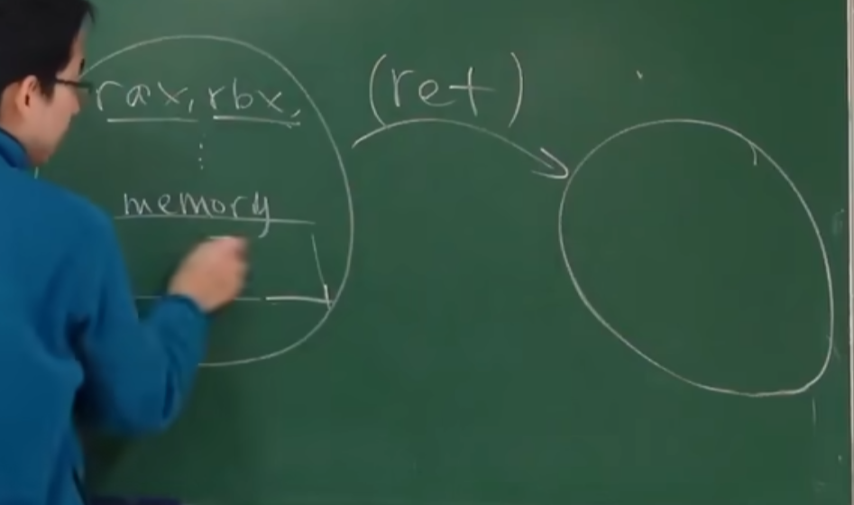
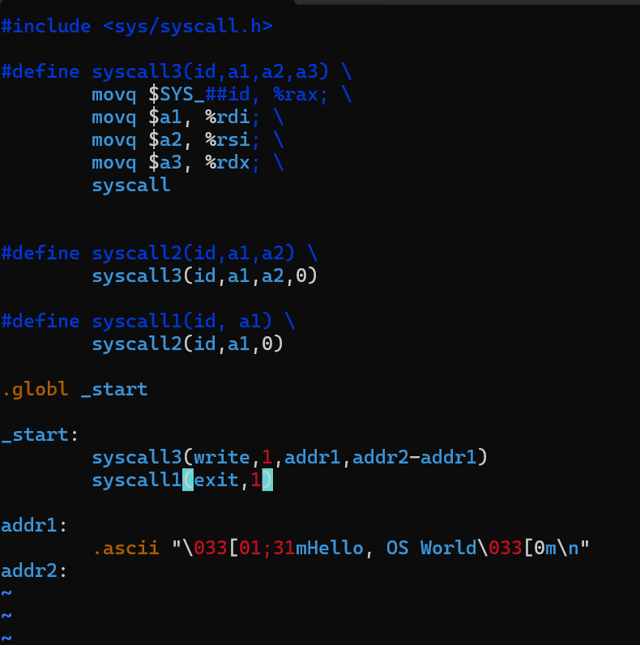
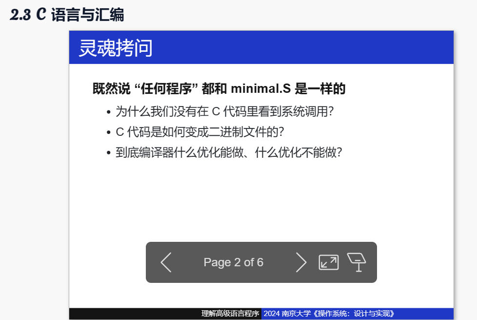
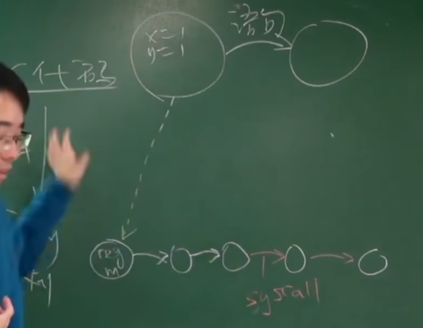

#所有程序都是状态机
    
==这个状态机的状态具体是每个寄存器上的值和内存中的值。每次程序运行就是状态机的状态转移，取指令，修改内存和寄存器的状态，这就是指令集能做到的东西==
在此基础上，我们发现指令集是无法退出程序的，也无法实现关机。这些其实就是操作系统的任务拉

###syscall
syscall指令是一个请求系统调用的指令。我们在执行syscall之前，我们把我们想做的事情交代好（每个寄存器放什么数据），然后调用syscall就行了。

##最小的程序

调用syscall实现最小的程序，就是状态机，改变内存和寄存器的值实现程序。
任何程序 = minimal.s = 状态机（算出需要的值交给操作系统然后躺平，指令+系统调用）

#C语言和汇编

C语言（高级语言）也是状态机，状态包括内存的值等等。和汇编的状态机一一对应。
状态 = 变量数值 + 栈
初始状态 = main第一条语句
状态迁移 = 执行一条语句