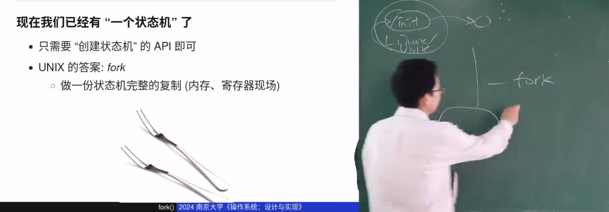
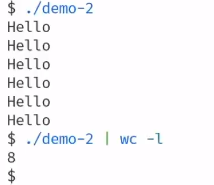
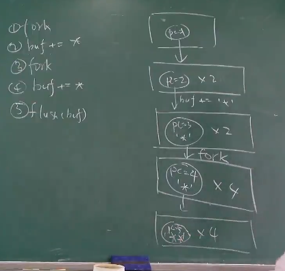

# 加载进程
操作系统开始运行的时候会加载一个init进程，这个进程我们可以一开始就指定，但是如果开init进程给删掉了那么就会导致u出错。

# fork
所有进程，整个计算机世界都是由init进程来的。


fork就是叉子的意思，代表clone出来一个一模一样的进程。

fork的两个进程，除了rax寄存器不一样，其他完全一样。执行frok的进程返回子进程的进程号，子进程返回0；

frok后的进程会在多个CPU上并行运行，如果只有一个CPU也会在CPU上轮转的运行。

下面这个代码会打印多少次？
```
pid_t x = fork();
pid_t y = fork();
printf("%d,%d\n:,x,y);
```


## printf
printf 百分之百确定已经运行了，但是为什么没有打印出来？

setvbuf：
unbuffered      不容易出错，但是呢，来一个字符就调用一次系统调用打印字符性能很差。
line buffered   交互式终端，换行结束
fully buffered  性能最重要 管道常用

```
for(int i = 0; i < 2 ; i++){
    fork();
    printf("hello")
}
```



为什么会导致打印八？这是因为printf有缓冲区，这个缓冲区会导致不会立即打印。 然而，这个缓冲区也是进程内存的一部分，也会被复制。


# execve
我们需要对状态机进行重置，要它运行其他进程。不然的话，整个计算机就一个进程。

execve就是重置状态机，并把对应参数塞到这个状态机里面。

那么什么是可执行文件呢？它就是状态机的初始状态。

创建的子进程会默认继承环境变量的。

```
execve(argv[0],arg[v],env)
```

## PATH 环境变量
我们想执行demo这个可执行文件，demo是不行的，必须./demo。 ./代表的是当前目录。如果我们需要直接demo可以运行呢？

**每一个运行文件都会进行文件查找，首先查找PATH。给PATH加上这个环境变量即可实现demo运行**

# _exit 销毁状态机
exit有多种写法
例如： return； exit（），SYS(SYS_exit,0);

什么是年normalexit： 调用libc实现的exit 例如，return，exit是normalexit。