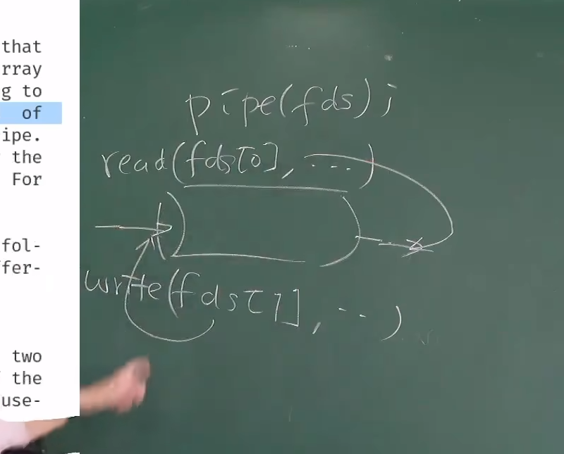
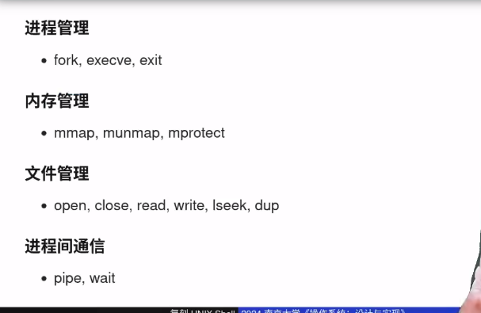

# 操作系统的对象
就是文件
everything is file 所有对象都是文件

## 文件描述符  指向操作系统对象的指针

在windows中文件描述符是handle

很形象的描述，当我们拥有这个handle，我们就可以控制这个file

## 匿名管道

同时一个进程控制写和读的管道有什么用？ 它真正有用的时候在于fork后

```
#include <stdio.h>
#include <stdlib.h>
#include <unistd.h>
#include <sys/wait.h>

int main() {
    int pipe_fd[2]; // pipe_fd[0] 表示读端，pipe_fd[1] 表示写端
    pid_t child_pid;
    char buf[] = "Hello World";

    if (pipe(pipe_fd) == -1) { // 创建管道
        perror("pipe failed");
        exit(EXIT_FAILURE);
    }

    child_pid = fork(); // 创建一个子进程
    if (child_pid == -1) {
        perror("fork failed");
        exit(EXIT_FAILURE);
    }

    if (child_pid == 0) { // 子进程
        close(pipe_fd[1]); // 关闭写端
        while (read(pipe_fd[0], &buf, 1) > 0) { // 从读端读出数据
            write(STDOUT_FILENO, &buf, 1); // 写入到标准输出流显示
        }
        close(pipe_fd[0]);
        _exit(EXIT_SUCCESS);
    } else { // 父进程
        close(pipe_fd[0]); // 关闭读端
        write(pipe_fd[1], &buf, strlen(buf)); // 往写端写入数据
        close(pipe_fd[1]);
        wait(NULL); // 等待并回收子进程
        _exit(EXIT_SUCCESS);
    }

    return 0;
}

```

pipefd是存的指针，fork也会拷贝这个指针
这样子进程只读，父进程只写，完成了进程之间的通信。

## 重定向的基本原理
每个进程在启动时都会打开三个特殊的文件描述符（File Descriptor，简称FD）：

标准输入（STDIN）：文件描述符为0，用于读取输入。
标准输出（STDOUT）：文件描述符为1，用于写入输出。
标准错误（STDERR）：文件描述符为2，用于写入错误信息。
这些文件描述符是进程与其环境（通常是终端或其他程序）交互的通道。默认情况下，STDIN绑定到键盘，STDOUT和STDERR绑定到屏幕。

当我们执行重定向操作时，实际上是在改变这些文件描述符所指向的文件或设备。例如，当我们使用command > file命令时，shell会将STDOUT的指向从屏幕改为file文件。这意味着，command的输出不再显示在屏幕上，而是写入到file文件中。

重定向的实现依赖于操作系统提供的系统调用。例如，open系统调用用于打开文件，dup或dup2系统调用用于复制文件描述符。

流程：
- 关闭初始的标准输出描述符
- 打开文件 使用open系统调用
- dup复制文件描述符到文件描述符1的位置
  

# Shell
shell ：壳 外壳 kenel的外壳


我们了解了所有的基本系统调用以后，就可以直接不依赖任何库函数，实现shell。
首先：getcmd，把所有命令读到buff里面
其次  paresecmd   解析命令，按照优先级构成一个命令树
最后执行


