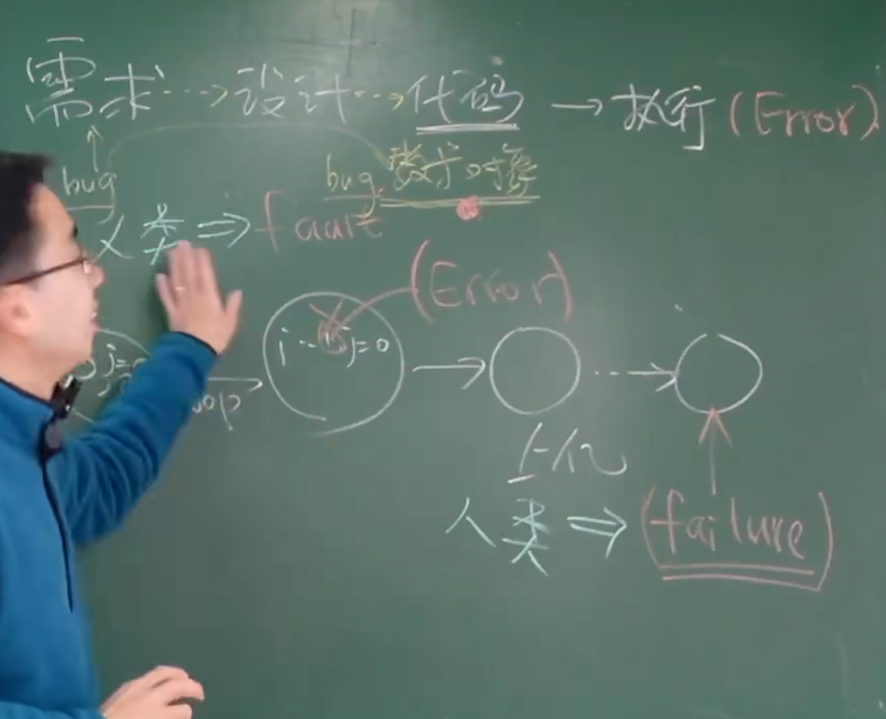
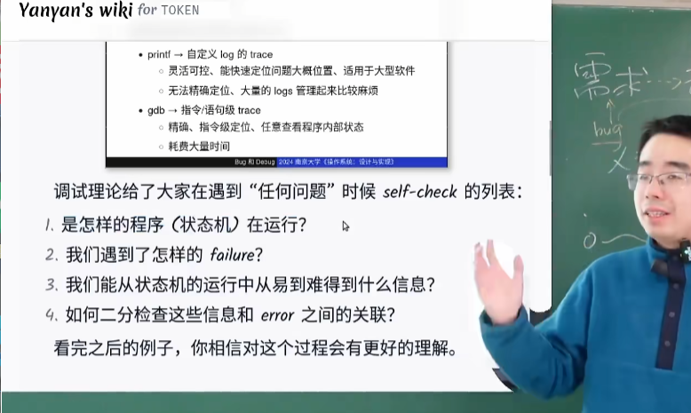
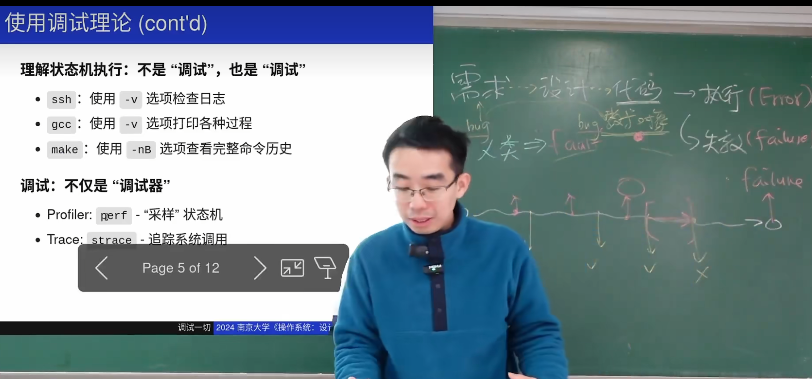

# 引子
```
lock();
sum++;
unlock();
```
这样逻辑上是对的，但是我们忘了优化器的存在，优化器会按照它自己的想法根据运行速度快慢来决定指令的执行顺序（不影响效果的情况下）

也就是说，我们可能会先unlock再sum++；这就出错了

## 结论
并发BUG可能会在特定的编译器+编译选项+特别的机器+运气  触发。

# Bug和调试理论

## 公理
- 机器永远是对的，我们绝对可以把背后真正的问题找到。

- 未测代码永远是错的。对自己做的任何东西都要有怀疑的态度。

## Fault error failure


我们为什么会感到难查找bug，因为我们犯的是fault的错误，观察到的是failure的错误。我们无法预知错误在哪儿。

调试的check list


# 调试一切
## 常用的debug方法


PROFILER:
TRACE:

他们所做的是把状态机打开


在strace中的使用技巧。
___
strace -f (编译命令)  &| vim
\.h 找寻.h
%!grep \.h  每一行都有.h  // %! 是vim中的过滤命令，过滤后传给grep。

%! grep -v 子段   grep 不包含这个子段的子段。


仔细阅读并学习gdb。
quickrefence。

