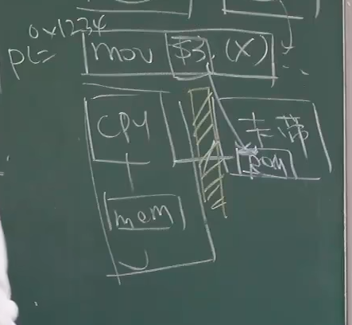
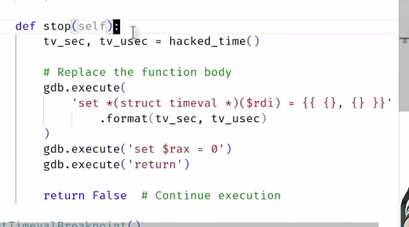
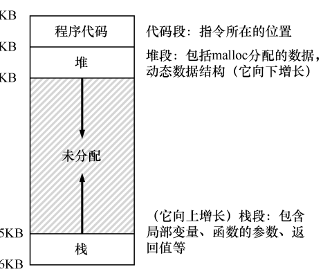
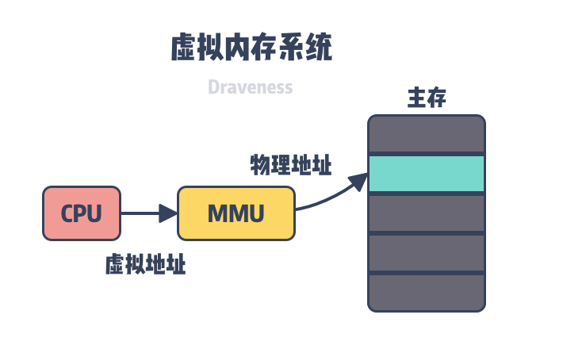

# 如何查看进程的地址空间？
- 在LINUX中 everything is file。  我们可以在proc/进程号/maps 看进程的地址空间。
- 利用工具：pmap 进程号

## 如何理解地址空间
一方面  地址空间是一段连续的平坦的0-2^64-1的地址空间。 我们可以把任何64位的整数转换成指针去访问内存。
一方面，地址空间被分为很多个段，每一个段都有自己对应的操作权限。

# mmap 系统调用
mmap 在状态机中增加/删除/修改一个可访问的内存

mprotect 系统调用，可以修改内存映射权限。

mmap可以瞬间分配一个巨大的内存，甚至等大于计算机的内存，这是为什么？

# 金手指
## gdb 为什么能看到别的进程的内心世界？
首先，每一个进程应该是封闭的，类似于人，每个人都看不透其他人在想什么。 那么为什么gdb可以看到呢？

是因为gdb有一个特别的系统调用可以把目标进程的空间搬到gdb进程里。
## 金手指：直接物理劫持内存
金手指是怎么做到入侵别人的进程空间的呢？

当时游戏机的结构如上，当cpu要读rom上的代码的时候执行游戏的时候，我们可以在改变这个传输数据的电线，劫持这个传输的数据并修改。 然后研发出了直接设计了一个firmware，想启动游戏就的先启动作弊器金手指，然后金手指会调用卡带启动游戏。 这个金手指会修改特定指令的值达到作弊的效果。

# 金山游侠
当我们知道游戏越做越大，变量越来越多，很难一眼找到我们作弊需要改变的变量。 那么我们需要入侵到这个进程空间，在我们改动目标变量（通过游戏）前后跟着改变的变量的地址。
## mem文件
maps 文件:
- maps文件提供了进程的虚拟内存区域（VMA）的映射信息。
- 它显示了每个内存段的地址范围、权限、偏移量、设备信息和文件路径。
- 通过maps文件，可以了解进程的内存布局，包括代码段、数据段、堆、栈等。

 mem 文件:
- mem文件代表了进程的物理内存内容。
- 它是一个字符设备文件，允许直接访问进程的物理内存空间。
- 通过mem文件，可以读取或修改进程的内存内容，但这通常需要特定的权限和知识。

## 金山游侠的实现

# 变速齿轮
首先计算指令无法感知时间按，syscall是唯一的感知时间的方法。
- gettimefolay
- sleep
- alarm

只要把这些时间感知的代码改为我们的代码就能实现程序的变速。

## 具体实现：
我们在使用gdb的时候，给gettimefolay函数大一个断点。当断点执行到进入函数内部的时候，强行用gdb.execute来执行汇编代码（我们自己的函数），然后强行return。

就可以实现跳过系统调用直接用我们自己的代码

这个就叫HOOK机制。把目标函数的第一条命令变成跳转到我自己写的函数执行，执行我自己的逻辑，目标函数不执行它被钩子钩住了。

PATCH机制 用来去除或更新目标代码。常用来热补丁。不停机更新。

差异记录:
补丁记录了两个文件或代码版本之间的差异，这些差异可以是添加、修改或删除的内容。
版本更新:
通过应用补丁，可以将一个版本的更改应用到另一个版本，这对于修复错误、添加新功能或改进现有功能非常有用。

在操作系统中，补丁（patch）机制通常指的是一种更新技术。想象一下，你有一本书，但是发现书中有几个印刷错误。如果出版社每次发现错误就重新印刷一本新书，那将会非常浪费资源。相反，他们可以发布一个勘误表，告诉你哪一页的哪一行需要更正什么内容。这样，你只需要根据勘误表修改错 误，而不需要整本书都换掉。

在计算机操作系统中，补丁机制也是类似的。开发者会发现软件中的一些错误或者需要改进的地方，然后创建一个补丁文件。这个补丁文件包含了必要的更新和修正。用户只需要应用这个补丁，就可以将这些更改应用到现有的系统或程序中，而不需要完全重新安装或更新整个软件。

例如，在Linux系统中，patch命令就是用来应用补丁文件的。它会读取补丁文件中的指令，然后按照这些指令修改原始文件。这样，就可以快速地修复问题或更新功能，而不会影响到系统的其他部分。

# Notes 13-14 Chapter
## 13

原始操作系统效率低下，因此发明了时分共享系统。时分共享系统要求所有进程的数据都存储在内存中，但是都存储在内存中，保证每个进程的信息互不侵犯也是一个很大的挑战。

 
这是提供的内存抽象，满足easytouse。它为进程隐藏了物理内存这一概念，为进程提供了更加简洁和易用的接口以及更加复杂的功能。
当然，当我们描述地址空间时，所描述的是操作系统提供给运行程序的抽象（abstract）。程序不在物理地址 0～16KB 的内存中，而是加载在任意的物理地址。

例如，的进程 A 尝试在地址 0（我们将称其为虚拟地址，virtual address）执行加载操作时，然而操作系统在硬件的支持下，出于某种原因，必须确保不是加载到物理地址 0，而是物理地址 320KB（这是 A 载入内存的地址）。这是内存虚拟化的关键，这是世界上每一个现代计算机系统的基础。

### 深入了解虚拟内存
**首先明确，内存一般指的是主存**
#### 虚拟内存可以结合磁盘和物理内存的优势为进程提供看起来速度足够快并且容量足够大的存储；
起到缓存的作用。那么我们首先就的了解缓存的作用：
缓存的工作原理其实很像是你的个人助理。想象一下，你是一个忙碌的经理，手头有很多工作要处理，而你的助理就是缓存。

数据访问：当你需要处理某项工作（即计算机需要访问数据）时，你会先问你的助理（缓存）这项工作的文件是否就在你的桌子上（即缓存中是否存在所需数据）。

命中与未命中：
如果助理告诉你文件就在桌子上，这就是“命中”（cache hit），你可以直接拿起文件开始工作，这非常快速。
如果助理说文件不在桌子上，这就是“未命中”（cache miss），助理需要去文件室（即较慢的主存或其他存储介质）找到文件并带回来给你。

数据交换：如果你的桌子上没有空间了，助理会把一些你不急需的文件移回文件室，为新文件腾出空间。

提高效率：通过这种方式，即使文件室离你的办公室有点远（硬盘比RAM慢），你也不需要亲自去那里拿文件，因为你的助理（缓存）帮你管理了最重要和最常用的文件。这样，你就可以集中精力快速处理手头的工作，提高了工作效率。

我们可以将虚拟内存看作是在磁盘上一片空间，当这片空间中的一部分访问比较频繁时，该部分数据会以页为单位被缓存到主存中以加速 CPU 访问数据的性能，虚拟内存利用空间较大的磁盘存储作为『内存』并使用主存储缓存进行加速，让上层认为操作系统的内存很大而且很快，然而区域很大的磁盘并不快，而很快的内存也并不大。
如果RAM中的空间不足，操作系统会将当前不常用的数据移到硬盘上的虚拟内存中，同时将需要的数据从虚拟内存移回RAM。这个过程称为“交换”或“分页”。

#### 虚拟内存可以为进程提供独立的内存空间并引入多层的页表结构将虚拟内存翻译成物理内存，进程之间可以共享物理内存减少开销，也能简化程序的链接、装载以及内存分配过程；
简化链接：程序在运行前，需要将各种模块和库链接在一起。有了虚拟内存，这个过程更加灵活，因为链接的地址可以是虚拟的，而不必关心实际的物理内存地址。
简化加载：程序加载到内存中时，虚拟内存机制可以更有效地分配内存空间，不需要在物理内存中找到一个足够大的连续空间来加载整个程序

共享内存：
简单的例子就是当fork的时候，操作系统其实只fork了对应的页表，所以并没有复制物理内存。 这样其实父子进程都指向一个相同的物理内存。 同时也提供了写时复制的机制。

####  虚拟内存可以控制进程对物理内存的访问，隔离不同进程的访问权限，提高系统的安全性

#### 虚拟内存对程序员的意义
- 更大的地址空间，允许程序员编写使用内存超过物理内存的程序，使程序员不用担心这部分。
- 更安全。在程序员的视角，进程相互独立，互不影响。不用担心影响其他进程或内核程序。
  

